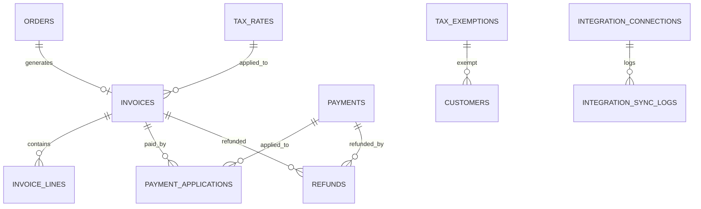
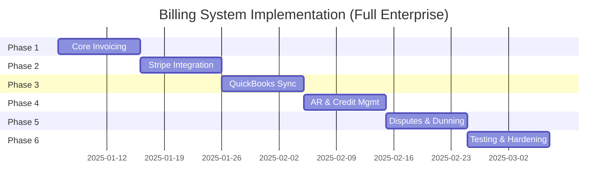

# Enterprise Accounting System PRD (Integration-First)

## 1. Overview

- **Feature**: Accounts Receivable & Payment Integration System
- **Priority**: P1 (Core Infrastructure - Foundation for financial operations)
- **Status**: Not Started
- **Dependencies**: 
  - Orders Management (P1) - Orders generate invoices
  - Quotes System (P0 Complete) - Quote conversions create receivables
  - RBAC System (Complete) - Permission enforcement
- **Estimated Effort**: 280-340 hours (8-10 weeks)
- **Platform Value Addition**: $150,000 - $220,000

### Audit Status

| Perspective | Status | Notes |
|-------------|--------|-------|
| **Business** | ✅ Complete | Integration-first validated against Business_Plan.md |
| **Legal/Compliance** | ✅ Complete | Invoice requirements, data retention, PCI documented |
| **Accounting** | ✅ Complete | Credit memos, write-offs, payment terms included |
| **Architecture** | ✅ Complete | Idempotency, audit trails, soft deletes included |
| **MAANG Quality** | ✅ Complete | Immutability, constraints, error codes defined |

### 1.1 Design Philosophy: Integration-First

> **CRITICAL**: This system follows an **Integration-First** approach. We BUILD what makes MedSource Pro unique and INTEGRATE with industry-leading tools for everything else.

| Approach | What We Do | Why |
|----------|------------|-----|
| **BUILD** | Invoice generation, AR tracking, payment recording | Unique to our platform |
| **INTEGRATE** | Stripe for payments, QuickBooks for accounting | Industry best practice |
| **DON'T BUILD** | Full GL, Bank Reconciliation, Financial Statements | Customers already have QuickBooks |

### 1.2 Why Integration-First?

**Your end customers (medical suppliers) already have:**
- ✅ QuickBooks or Xero (90%+ of SMBs)
- ✅ Their own accountant/bookkeeper
- ✅ Established accounting processes

**They DON'T want:**
- ❌ A second accounting system to manage
- ❌ To re-enter data they already have
- ❌ To learn a new GL system

**They DO want:**
- ✅ Invoices generated automatically from orders
- ✅ Easy online payment collection (Stripe)
- ✅ Integration with their EXISTING accounting software
- ✅ AR visibility (who owes them money)

### 1.3 Industry Validation

Every modern SaaS platform integrates, they don't build:

| Platform | Builds Full GL? | Integration Strategy |
|----------|-----------------|---------------------|
| Shopify | ❌ No | Integrates with QuickBooks |
| Square | ❌ No | Integrates with QuickBooks |
| Salesforce | ❌ No | Integrates with QuickBooks |
| HubSpot | ❌ No | Integrates with QuickBooks |
| **MedSource Pro** | ❌ No | Integrates with QuickBooks |

---

## 2. Business Context

### 2.1 Why This Feature Matters

**From `Business_Plan.md`:**

MedSource Pro is a white-label B2B ordering platform licensed to agencies, consultants, and VARs. Each licensee (partner) operates their own instance serving their end customers (medical suppliers, distributors).

**The Financial Flow in B2B Ordering:**

```
Quote Approved → Order Created → Invoice Generated → Payment Received
                                        ↓                    ↓
                               Synced to QuickBooks    Stripe Webhook
                                        ↓                    ↓
                               Customer's Full GL    MedSource Updated
```

### 2.2 Business Value

| Stakeholder | Value Delivered |
|-------------|-----------------|
| **End Customers (Medical Suppliers)** | Auto-invoicing, online payments, QuickBooks sync |
| **End Users (Hospitals/Clinics)** | Easy online payment, payment history |
| **Partners (Agencies/VARs)** | Differentiated platform with financial features |
| **Platform Owner** | Higher platform value, competitive advantage |

### 2.3 What We Build vs. Integrate

| Feature | Build/Integrate | Tool | Rationale |
|---------|-----------------|------|-----------|
| Invoice Generation | **BUILD** | MedSource | Unique to our order flow |
| Payment Tracking | **BUILD** | MedSource | Track paid/unpaid status |
| AR Aging | **BUILD** | MedSource | Core visibility feature |
| Customer Statements | **BUILD** | MedSource | PDF generation |
| Online Payments | **INTEGRATE** | Stripe | Industry leader, PCI compliant |
| Accounting Sync | **INTEGRATE** | QuickBooks | Customer already uses this |
| General Ledger | ❌ DON'T BUILD | QuickBooks | Customer has this |
| Bank Reconciliation | ❌ DON'T BUILD | QuickBooks | Customer does this there |
| Financial Statements | ❌ DON'T BUILD | QuickBooks | Customer generates there |

---

## 3. Role-Based Requirements

### 3.1 Customer View (Hospital/Clinic)

**Can:**
- View invoices for their orders
- See payment status and history
- Download invoice PDFs
- **Pay invoices online via Stripe**
- View account statement

**Cannot:**
- See other customers' financial data
- Modify invoices or payments
- Access internal pricing or margins

**Sees:**
- Invoice list with status (Draft, Sent, Paid, Overdue)
- "Pay Now" button for unpaid invoices
- Payment history
- Outstanding balance

---

### 3.2 Sales Rep View

**Can:**
- View invoices for orders from assigned quotes
- See payment status for assigned customers
- Request invoice adjustments (creates approval workflow)

**Cannot:**
- Create manual invoices
- Record payments
- Access all customer invoices

**Sees:**
- Invoice list (assigned customers only)
- Payment collection status
- Outstanding AR for assigned accounts

---

### 3.3 Sales Manager View

**Can:**
- View all invoices and AR aging
- Create manual invoices
- Record offline payments (checks, wire transfers)
- Send payment reminders
- View revenue reports

**Cannot:**
- Configure integrations (QuickBooks, Stripe)
- Process refunds

**Sees:**
- Full AR dashboard with aging
- Revenue reports by customer/product
- Collection performance metrics

---

### 3.4 Admin / Accountant View

**Can:**
- **Full Access** to all AR features
- Configure Stripe integration
- Configure QuickBooks integration
- Process refunds
- Void invoices
- Export data

**Cannot:**
- Nothing restricted

**Sees:**
- Complete AR dashboard
- Integration status (Stripe, QuickBooks)
- Sync logs and errors
- All invoices across all customers

---

## 4. RBAC Permission Matrix

| Permission | Customer | Sales Rep | Sales Mgr | Admin |
|------------|----------|-----------|-----------|-------|
| **Invoices** |
| View Own Invoices | ✅ | ❌ | ❌ | ❌ |
| View Assigned Invoices | ❌ | ✅ | ❌ | ❌ |
| View All Invoices | ❌ | ❌ | ✅ | ✅ |
| Create Manual Invoice | ❌ | ❌ | ✅ | ✅ |
| Send Invoice | ❌ | ❌ | ✅ | ✅ |
| Void Invoice | ❌ | ❌ | ❌ | ✅ |
| **Payments** |
| Pay Own Invoice (Stripe) | ✅ | ❌ | ❌ | ❌ |
| Record Offline Payment | ❌ | ❌ | ✅ | ✅ |
| Process Refund | ❌ | ❌ | ❌ | ✅ |
| **Reports** |
| View Own Statement | ✅ | ❌ | ❌ | ❌ |
| View AR Aging | ❌ | ✅ (assigned) | ✅ | ✅ |
| Export Reports | ❌ | ❌ | ✅ | ✅ |
| **Integrations** |
| View Integration Status | ❌ | ❌ | ✅ | ✅ |
| Configure Stripe | ❌ | ❌ | ❌ | ✅ |
| Configure QuickBooks | ❌ | ❌ | ❌ | ✅ |

---

## 5. User Stories

### Epic 1: Invoice Generation

Invoices are automatically created from orders and can be manually created for non-order items.

**US-INV-001**: As an Admin, I want invoices auto-generated from orders so billing is seamless.
- **Priority**: P0
- **Acceptance Criteria**:
  - [ ] Given order status changes to "Confirmed", when processed, then invoice is auto-created
  - [ ] Given invoice created, when viewing, then it contains order items, quantities, prices, tax
  - [ ] Given invoice created, when viewing, then status is "Draft" awaiting review
  - [ ] Given invoice auto-created, when checking, then invoice number is auto-assigned

**US-INV-002**: As a Sales Manager, I want to create invoices manually so I can bill for non-order items.
- **Priority**: P1
- **Acceptance Criteria**:
  - [ ] Given I click "New Invoice", when form opens, then I can select customer
  - [ ] Given I add line items, when entering, then subtotal, tax, and total calculate automatically
  - [ ] Given I save as draft, when saved, then invoice is created with "Manual" source
  - [ ] Given no order linked, when viewing, then order reference is blank

**US-INV-003**: As an Admin, I want to send invoices to customers so they receive billing notification.
- **Priority**: P0
- **Acceptance Criteria**:
  - [ ] Given draft invoice, when I click "Send", then invoice status changes to "Sent"
  - [ ] Given invoice sent, when customer logs in, then they see invoice in their portal
  - [ ] Given email configured, when invoice sent, then customer receives email with PDF + "Pay Now" link
  - [ ] Given "Pay Now" link clicked, when customer proceeds, then Stripe checkout opens

**US-INV-004**: As a Customer, I want to view my invoices so I can see what I owe.
- **Priority**: P0
- **Acceptance Criteria**:
  - [ ] Given I log in, when I navigate to "Billing", then I see my invoice list
  - [ ] Given invoice list, when viewing, then I see invoice number, date, amount, status
  - [ ] Given I click invoice, when viewing, then I see full line item details
  - [ ] Given invoice is sent, when viewing, then I can download PDF
  - [ ] Given unpaid invoice, when viewing, then "Pay Now" button is visible

**US-INV-005**: As an Admin, I want to void an invoice so I can handle billing errors.
- **Priority**: P1
- **Acceptance Criteria**:
  - [ ] Given sent invoice with no payments, when I click "Void", then status changes to "Void"
  - [ ] Given voided invoice, when QuickBooks synced, then invoice voided in QuickBooks
  - [ ] Given invoice with payments, when I click "Void", then error shows "Must refund first"

### Invoice Status Flow

```
Draft → Sent → Paid
         ↓      ↓
       Void  Partial → Paid
                ↓
              Refunded
```

### Invoice Numbering

**Format**: `INV-{TENANT_PREFIX}-{YEAR}{MONTH}-{SEQUENCE}`

**Examples**:
- `INV-MED-202501-0001` (MedSource, January 2025, first invoice)
- `INV-MED-202501-0002` (MedSource, January 2025, second invoice)

---

### Epic 2: Stripe Payment Integration

Stripe handles all online payment processing, PCI compliance, and payment notifications.

**US-PAY-001**: As a Customer, I want to pay invoices online so payment is convenient.
- **Priority**: P0
- **Acceptance Criteria**:
  - [ ] Given unpaid invoice, when viewing, then "Pay Now" button is visible
  - [ ] Given I click "Pay Now", when proceeding, then Stripe checkout opens
  - [ ] Given I can pay by credit card or ACH bank transfer
  - [ ] Given successful payment, when completed, then invoice updates to "Paid"
  - [ ] Given successful payment, when checking, then payment synced to QuickBooks
  - [ ] Given failed payment, when error occurs, then error message shows

**US-PAY-002**: As an Admin, I want to connect Stripe so customers can pay online.
- **Priority**: P0
- **Acceptance Criteria**:
  - [ ] Given I navigate to Integrations, when clicking "Connect Stripe", then OAuth flow starts
  - [ ] Given I authorize, when returning, then connection status shows "Connected"
  - [ ] Given connected, when invoice sent, then "Pay Now" link is included in email
  - [ ] Given Stripe webhook fires, when payment succeeds, then invoice marked paid

**US-PAY-003**: As a Sales Manager, I want to record offline payments so all payments are tracked.
- **Priority**: P0
- **Acceptance Criteria**:
  - [ ] Given open invoice, when I click "Record Payment", then payment form opens
  - [ ] Given I select payment method (Check, Wire, Cash), when entering, then reference field appears
  - [ ] Given full payment, when saved, then invoice status changes to "Paid"
  - [ ] Given partial payment, when saved, then invoice shows remaining balance
  - [ ] Given payment recorded, when checking QuickBooks, then payment synced

**US-PAY-004**: As an Admin, I want to process refunds so I can handle returns.
- **Priority**: P1
- **Acceptance Criteria**:
  - [ ] Given paid invoice (Stripe payment), when I click "Refund", then refund form opens
  - [ ] Given I enter refund amount, when saving, then Stripe refund is processed
  - [ ] Given partial refund, when saved, then invoice shows credit applied
  - [ ] Given full refund, when saved, then invoice status becomes "Refunded"
  - [ ] Given refund processed, when checking QuickBooks, then refund synced

### Stripe Integration Architecture

```
┌─────────────────────────────────────────────────────────────┐
│                     MEDSOURCE PRO                            │
│  ┌──────────────┐                    ┌──────────────────┐   │
│  │   INVOICE    │───── Pay Now ─────→│ Stripe Checkout  │   │
│  └──────────────┘                    └──────────────────┘   │
│         ↑                                     │              │
│         │                                     ↓              │
│  ┌──────────────┐                    ┌──────────────────┐   │
│  │   PAYMENT    │←── Webhook ────────│ payment_intent.  │   │
│  │   RECORDED   │                    │    succeeded     │   │
│  └──────────────┘                    └──────────────────┘   │
└─────────────────────────────────────────────────────────────┘
```

### Stripe Webhook Events

| Event | Action |
|-------|--------|
| `payment_intent.succeeded` | Mark invoice paid, sync to QuickBooks |
| `payment_intent.payment_failed` | Log failure, notify admin |
| `charge.refunded` | Mark refund, sync to QuickBooks |

### Payment Methods Supported

| Method | Provider | Fee | Best For |
|--------|----------|-----|----------|
| Credit Card | Stripe | 2.9% + $0.30 | Small invoices |
| ACH Bank Transfer | Stripe | 0.8% (max $5) | Large invoices |
| Check | Offline | $0 | Traditional customers |
| Wire Transfer | Offline | $0 | International |

---

### Epic 3: QuickBooks Integration

QuickBooks handles the full general ledger, financial statements, and tax reporting. We sync invoices and payments in real-time.

**US-QB-001**: As an Admin, I want to connect QuickBooks so data syncs automatically.
- **Priority**: P0
- **Acceptance Criteria**:
  - [ ] Given I navigate to Integrations, when clicking "Connect QuickBooks", then OAuth flow starts
  - [ ] Given I authorize, when returning, then connection status shows "Connected"
  - [ ] Given connected, when invoice created, then it syncs to QuickBooks within 5 seconds
  - [ ] Given QB connection lost, when detected, then admin is notified

**US-QB-002**: As an Admin, I want to configure account mapping so invoices sync correctly.
- **Priority**: P0
- **Acceptance Criteria**:
  - [ ] Given QB connected, when viewing settings, then account mapping shows
  - [ ] Given I map "Product Revenue" to QB account, when invoice syncs, then correct account used
  - [ ] Given unmapped account type, when syncing, then error shows "Map account first"
  - [ ] Given I click "Auto-Map", when processing, then system suggests mappings by name

**US-QB-003**: As an Admin, I want customers synced to QuickBooks so invoices have valid customers.
- **Priority**: P0
- **Acceptance Criteria**:
  - [ ] Given new customer created in MedSource, when syncing, then customer created in QB
  - [ ] Given customer already exists in QB (by email), when syncing, then linked, not duplicated
  - [ ] Given customer updated in MedSource, when syncing, then QB customer updated

**US-QB-004**: As an Admin, I want to view sync status so I know if integrations are healthy.
- **Priority**: P0
- **Acceptance Criteria**:
  - [ ] Given I view Integrations dashboard, when loaded, then each connection shows status
  - [ ] Given sync successful, when viewing, then green checkmark and last sync time show
  - [ ] Given sync failed, when viewing, then red warning and error details show
  - [ ] Given individual record failed, when viewing, then I can click "Resync"

### QuickBooks Sync Architecture

```
┌─────────────────────────────────────────────────────────────┐
│                     MEDSOURCE PRO                            │
│                                                              │
│  ┌──────────────┐  ┌──────────────┐  ┌──────────────────┐   │
│  │   CUSTOMER   │  │   INVOICE    │  │     PAYMENT      │   │
│  │   Created    │  │   Created    │  │    Recorded      │   │
│  └──────┬───────┘  └──────┬───────┘  └────────┬─────────┘   │
│         │                 │                    │              │
└─────────│─────────────────│────────────────────│──────────────┘
          │                 │                    │
          ↓                 ↓                    ↓
┌─────────────────────────────────────────────────────────────┐
│                    QUICKBOOKS ONLINE                         │
│                                                              │
│  ┌──────────────┐  ┌──────────────┐  ┌──────────────────┐   │
│  │   Customer   │  │   Invoice    │  │     Payment      │   │
│  │   Created    │  │   Created    │  │    Recorded      │   │
│  └──────────────┘  └──────────────┘  └──────────────────┘   │
│                                                              │
│  ┌────────────────────────────────────────────────────────┐ │
│  │  QUICKBOOKS HANDLES: GL, Bank Recon, Tax, Statements   │ │
│  └────────────────────────────────────────────────────────┘ │
└─────────────────────────────────────────────────────────────┘
```

### QuickBooks Sync Rules

| MedSource Event | QuickBooks Action | Timing |
|-----------------|-------------------|--------|
| Customer created | Create Customer | Real-time |
| Customer updated | Update Customer | Real-time |
| Invoice created | Create Invoice | Real-time |
| Invoice sent | Update Invoice status | Real-time |
| Invoice voided | Void Invoice | Real-time |
| Payment recorded | Create Payment | Real-time |
| Refund processed | Create Refund Receipt | Real-time |

### Default Account Mapping

| MedSource Type | QuickBooks Account (Default) |
|----------------|------------------------------|
| Product Revenue | Income:Sales |
| Shipping Revenue | Income:Shipping |
| Sales Tax | Liability:Sales Tax Payable |
| Payments Received | Undeposited Funds |
| Accounts Receivable | Accounts Receivable |

---

### Epic 4: AR Aging & Reporting

AR Aging shows outstanding receivables grouped by how overdue they are.

**US-AR-001**: As a Sales Manager, I want to view AR aging so I can track collection performance.
- **Priority**: P0
- **Acceptance Criteria**:
  - [ ] Given I view AR Aging, when loaded, then invoices are grouped by age buckets
  - [ ] Given aging report, when viewing, then I see: Current, 1-30, 31-60, 61-90, 90+ days
  - [ ] Given aging report, when viewing, then I see totals per bucket and overall
  - [ ] Given I click a bucket, when drilling down, then I see individual invoices
  - [ ] Given I export, when downloading, then CSV contains all aging data

**US-AR-002**: As a Customer, I want to view my account statement so I can see my balance history.
- **Priority**: P1
- **Acceptance Criteria**:
  - [ ] Given I navigate to "My Statement", when loaded, then I see all invoices/payments
  - [ ] Given statement shows, when viewing, then running balance is calculated
  - [ ] Given I select date range, when filtering, then statement updates
  - [ ] Given I download, when clicking export, then PDF statement downloads

**US-AR-003**: As a Sales Manager, I want to send payment reminders so customers pay on time.
- **Priority**: P1
- **Acceptance Criteria**:
  - [ ] Given overdue invoice, when I click "Send Reminder", then email is sent to customer
  - [ ] Given email sent, when viewing invoice, then "Reminder sent on [date]" shows
  - [ ] Given I configure auto-reminders, when invoice is 7/14/30 days overdue, then reminders auto-send
  - [ ] Given reminder sent, when audit checked, then log records who sent and when

**US-AR-004**: As a Sales Manager, I want to view revenue reports so I can analyze sales.
- **Priority**: P1
- **Acceptance Criteria**:
  - [ ] Given I select "Revenue by Customer", when loading, then customers sorted by revenue
  - [ ] Given I filter by date, when applied, then only that period's revenue shows
  - [ ] Given I click customer, when drilling, then I see their invoices
  - [ ] Given I export, when downloading, then CSV contains all revenue data

### AR Aging Buckets

| Bucket | Days | Color | Action |
|--------|------|-------|--------|
| Current | 0 days | Green | No action needed |
| 1-30 | 1-30 days | Yellow | Send reminder |
| 31-60 | 31-60 days | Orange | Follow up call |
| 61-90 | 61-90 days | Red | Escalate |
| 90+ | 90+ days | Dark Red | Collections |

---

### Epic 5: Tax Handling (Simplified)

Tax is calculated on invoices and synced to QuickBooks for reporting.

**US-TAX-001**: As an Admin, I want to configure tax rates so invoices calculate tax correctly.
- **Priority**: P1
- **Acceptance Criteria**:
  - [ ] Given I navigate to Tax Settings, when viewing, then I see list of configured tax rates
  - [ ] Given I click "Add Tax Rate", when form opens, then I can set name, rate, jurisdiction
  - [ ] Given tax rate saved, when invoice created for that jurisdiction, then tax auto-applied
  - [ ] Given tax synced to QuickBooks, when checking, then QB tax rate is used

**US-TAX-002**: As an Admin, I want to mark customers as tax-exempt so they aren't taxed.
- **Priority**: P1
- **Acceptance Criteria**:
  - [ ] Given customer is tax-exempt, when I set exemption, then their invoices skip tax
  - [ ] Given exemption set, when invoice created, then "Tax Exempt" noted on invoice
  - [ ] Given exemption synced to QuickBooks, when checking, then QB customer marked exempt

### Tax Configuration

| Setting | Options | Notes |
|---------|---------|-------|
| Default Tax Rate | 0-15% | Applied to all invoices by default |
| Tax by Jurisdiction | State/County rules | Auto-applied based on customer address |
| Tax Exemptions | Per-customer | Exempt customers pay no tax |
| Tax Sync | QuickBooks | Tax amounts synced, QB handles reporting |

---

### Epic 6: Credit Memos & Adjustments

Credit memos allow billing corrections without processing refunds (e.g., pricing errors, returns, goodwill credits).

**US-CM-001**: As an Admin, I want to issue credit memos so I can correct billing errors.
- **Priority**: P1
- **Acceptance Criteria**:
  - [ ] Given I navigate to a customer, when I click "New Credit Memo", then form opens
  - [ ] Given I enter credit amount and reason, when saved, then credit memo is created
  - [ ] Given credit memo created, when viewing customer, then credit balance shows
  - [ ] Given credit memo synced to QuickBooks, when checking, then QB credit memo exists

**US-CM-002**: As an Admin, I want to apply credits to invoices so outstanding balances are reduced.
- **Priority**: P1
- **Acceptance Criteria**:
  - [ ] Given customer has credit balance, when viewing unpaid invoice, then "Apply Credit" button shows
  - [ ] Given I click "Apply Credit", when selecting amount, then balance due decreases
  - [ ] Given full credit applied, when invoice balance is zero, then status changes to "Paid"
  - [ ] Given credit applied, when QuickBooks synced, then credit application syncs

### Credit Memo Types

| Type | Use Case | Creates Refund? |
|------|----------|-----------------|
| **Billing Error** | Incorrect pricing, wrong items | No |
| **Return Credit** | Customer returned items | No (unless requested) |
| **Goodwill Credit** | Customer satisfaction | No |
| **Promotional Credit** | Marketing promotion | No |

---

### Epic 7: Payment Terms & Credit Limits

Configurable payment terms and customer credit management.

**US-PT-001**: As an Admin, I want to configure payment terms so invoices have correct due dates.
- **Priority**: P1
- **Acceptance Criteria**:
  - [ ] Given I navigate to Settings, when viewing Payment Terms, then I see list of terms
  - [ ] Given I create "Net 60", when saving, then term is available for invoices
  - [ ] Given customer has default term, when invoice created, then due date calculated correctly
  - [ ] Given "2/10 Net 30" term, when invoice viewed, then early payment discount shows

**US-PT-002**: As an Admin, I want to set credit limits so I can manage customer risk.
- **Priority**: P1
- **Acceptance Criteria**:
  - [ ] Given customer profile, when I set credit limit $50,000, then limit is saved
  - [ ] Given customer has $45,000 outstanding, when new $10,000 order created, then warning shows
  - [ ] Given customer over credit limit, when Sales Manager approves, then order proceeds
  - [ ] Given credit limit exceeded, when order blocked, then notification sent to Sales Manager

**US-PT-003**: As an Admin, I want to charge late fees so customers pay on time.
- **Priority**: P2
- **Acceptance Criteria**:
  - [ ] Given late fee configured (1.5%/month), when invoice is 30+ days overdue, then late fee line added
  - [ ] Given late fee added, when customer pays, then late fee included in payment
  - [ ] Given late fee waived, when Admin marks waived, then late fee removed

### Payment Terms Configuration

| Term Code | Description | Days | Early Discount |
|-----------|-------------|------|----------------|
| NET30 | Net 30 Days | 30 | None |
| NET60 | Net 60 Days | 60 | None |
| 2/10NET30 | 2% discount if paid in 10 days | 30 | 2% if ≤10 days |
| DUE_RECEIPT | Due on Receipt | 0 | None |
| NET45 | Net 45 Days | 45 | None |

---

### Epic 8: Write-Offs & Bad Debt

Workflow for writing off uncollectible invoices.

**US-WO-001**: As an Admin, I want to write off bad debt so AR reflects collectible amounts.
- **Priority**: P1
- **Acceptance Criteria**:
  - [ ] Given invoice is 120+ days overdue, when I click "Write Off", then write-off form opens
  - [ ] Given I enter reason and approval, when saved, then invoice status changes to "Written Off"
  - [ ] Given write-off processed, when QuickBooks synced, then bad debt expense recorded
  - [ ] Given write-off requires approval, when Sales Manager approves, then write-off completes

**US-WO-002**: As an Admin, I want to recover written-off amounts so I can handle late payments.
- **Priority**: P2
- **Acceptance Criteria**:
  - [ ] Given written-off invoice, when customer pays, then recovery form opens
  - [ ] Given recovery recorded, when QuickBooks synced, then bad debt recovery recorded
  - [ ] Given partial recovery, when saved, then remaining amount stays written off

### Write-Off Workflow

```
Invoice Overdue (90+ days)
        ↓
Send to Collections (optional)
        ↓
Approve Write-Off (Sales Manager)
        ↓
Status: Written Off
        ↓
Sync to QuickBooks (Bad Debt Expense)
        ↓
If customer pays later → Recovery
```

---

### Epic 9: Invoice Disputes

Workflow for handling invoice disputes from customers.

**US-DIS-001**: As a Customer, I want to dispute an invoice so billing errors can be corrected.
- **Priority**: P1
- **Acceptance Criteria**:
  - [ ] Given I view an invoice, when I click "Dispute", then dispute form opens
  - [ ] Given I submit dispute with reason, when saved, then dispute is created
  - [ ] Given dispute submitted, when Sales Manager views, then dispute appears in queue
  - [ ] Given dispute resolved (credit issued), when resolved, then customer notified

**US-DIS-002**: As a Sales Manager, I want to resolve disputes so customers are satisfied.
- **Priority**: P1
- **Acceptance Criteria**:
  - [ ] Given dispute queue, when I view, then I see all open disputes
  - [ ] Given I resolve dispute, when selecting resolution (credit, void, no action), then dispute closes
  - [ ] Given credit issued, when resolved, then credit memo auto-created
  - [ ] Given dispute resolved, when audit checked, then full history recorded

### Dispute Resolution Options

| Resolution | Action | Result |
|------------|--------|--------|
| **Issue Credit** | Create credit memo | Customer receives credit |
| **Void Invoice** | Void original invoice | Invoice removed from AR |
| **Adjust Invoice** | Modify invoice amounts | Invoice balance updated |
| **No Action** | Reject dispute | Invoice remains as-is |
| **Partial Credit** | Issue partial credit | Partial credit memo created |

---

### Epic 10: Dunning Process (Automated Collections)

Automated workflow for collecting overdue payments.

**US-DUN-001**: As an Admin, I want to configure dunning rules so collections are automated.
- **Priority**: P2
- **Acceptance Criteria**:
  - [ ] Given I navigate to Dunning Settings, when viewing, then I see dunning rules
  - [ ] Given rule "7 days overdue = Email reminder", when invoice hits 7 days, then email sent
  - [ ] Given rule "30 days = Phone call task", when invoice hits 30 days, then task created for Sales Rep
  - [ ] Given dunning disabled for customer, when invoice overdue, then no automated actions

**US-DUN-002**: As a Sales Manager, I want to view dunning status so I know collection efforts.
- **Priority**: P2
- **Acceptance Criteria**:
  - [ ] Given overdue invoice, when viewing, then I see dunning history (emails sent, calls made)
  - [ ] Given I manually contact customer, when I log contact, then it appears in dunning history
  - [ ] Given I pause dunning, when saved, then automated actions stop for that invoice

### Default Dunning Schedule

| Days Overdue | Action | Channel | Escalation |
|--------------|--------|---------|------------|
| 1 day | Friendly reminder | Email | None |
| 7 days | Payment reminder | Email | None |
| 14 days | Second reminder | Email + Portal | Sales Rep notified |
| 30 days | Urgent reminder | Email | Sales Manager notified |
| 45 days | Final notice | Email + Phone | Phone call task created |
| 60 days | Collections warning | Email + Letter | Collections team |
| 90 days | Send to collections | Internal | Write-off review |

---

## Legal & Compliance Requirements

### Invoice Legal Requirements

All invoices MUST include:

| Field | Required | Notes |
|-------|----------|-------|
| **Seller Business Name** | ✅ | Legal entity name |
| **Seller Address** | ✅ | Full business address |
| **Seller Tax ID** | ✅ | EIN or Tax Registration |
| **Buyer Business Name** | ✅ | Customer legal name |
| **Buyer Address** | ✅ | Billing address |
| **Invoice Number** | ✅ | Unique, sequential |
| **Invoice Date** | ✅ | Date of issue |
| **Due Date** | ✅ | Payment deadline |
| **Line Items** | ✅ | Description, qty, price |
| **Tax Breakdown** | ✅ | Tax rate, amount |
| **Total Amount** | ✅ | Including tax |
| **Payment Instructions** | ✅ | How to pay |
| **Terms & Conditions** | ✅ | Payment terms, late fees |

### PCI DSS Compliance

| Requirement | Our Approach |
|-------------|--------------|
| **Card Data Storage** | ❌ We NEVER store card data |
| **Payment Processing** | ✅ Stripe handles all card processing |
| **Tokenization** | ✅ Stripe tokens only, no raw card data |
| **Encryption** | ✅ All data encrypted in transit (TLS 1.3) |
| **Access Control** | ✅ RBAC controls payment functions |

### Data Retention Policy

| Data Type | Retention Period | Legal Basis |
|-----------|------------------|-------------|
| Invoices | 7 years minimum | IRS requirements |
| Payments | 7 years minimum | IRS requirements |
| Tax Records | 7 years minimum | IRS requirements |
| Audit Logs | 7 years minimum | SOX compliance |
| Customer Data | Duration of relationship + 7 years | Business records |
| Deleted Records | Soft delete, 7 years | Audit trail |

### Refund Policy Enforcement

| Condition | Refund Allowed? | Approval Required? |
|-----------|-----------------|-------------------|
| Within 30 days of payment | ✅ Yes | Sales Manager |
| 30-90 days after payment | ✅ Yes | Admin |
| 90+ days after payment | ⚠️ Exception only | Admin + CFO |
| Disputed invoice | ✅ After resolution | Per dispute resolution |
| Partial refund | ✅ Yes | Sales Manager |

---

## 6. Technical Architecture

### 6.1 Database Schema

**Migration**: `YYYYMMDDHHMMSS_CreateInvoicingTables.cs`

#### Design Principles (MAANG-Level)

| Principle | Implementation |
|-----------|----------------|
| **Immutability** | Financial records are NEVER deleted, only soft-deleted |
| **Audit Trail** | All changes logged to `billing_audit_log` |
| **Optimistic Locking** | `row_version` on all mutable tables |
| **Idempotency** | `idempotency_key` on all payment/refund operations |
| **Soft Deletes** | `is_deleted`, `deleted_at` on all tables |
| **Referential Integrity** | All FKs enforced, no orphan records |
| **CHECK Constraints** | Business rules enforced at DB level |

```sql
-- ===========================================
-- PAYMENT TERMS (Reference Data)
-- ===========================================

CREATE TABLE payment_terms (
    id UUID PRIMARY KEY DEFAULT gen_random_uuid(),
    tenant_id UUID NOT NULL,
    code VARCHAR(20) NOT NULL,             -- NET30, 2/10NET30
    name VARCHAR(100) NOT NULL,            -- "Net 30 Days"
    days_until_due INT NOT NULL,           -- 30
    early_discount_percent DECIMAL(5,2),   -- 2.00 (2%)
    early_discount_days INT,               -- 10 (days to qualify)
    late_fee_percent DECIMAL(5,2),         -- 1.50 (1.5% per month)
    late_fee_grace_days INT DEFAULT 0,     -- Days after due before late fee
    is_default BOOLEAN DEFAULT FALSE,
    is_active BOOLEAN DEFAULT TRUE,
    created_at TIMESTAMPTZ DEFAULT NOW(),
    UNIQUE(tenant_id, code),
    CHECK (days_until_due >= 0),
    CHECK (early_discount_percent IS NULL OR early_discount_percent >= 0),
    CHECK (late_fee_percent IS NULL OR late_fee_percent >= 0)
);

-- ===========================================
-- CUSTOMER CREDIT LIMITS
-- ===========================================

CREATE TABLE customer_credit_limits (
    id UUID PRIMARY KEY DEFAULT gen_random_uuid(),
    tenant_id UUID NOT NULL,
    customer_id INT NOT NULL,
    credit_limit DECIMAL(19,4) NOT NULL,   -- Max outstanding AR
    current_balance DECIMAL(19,4) DEFAULT 0, -- Current AR balance
    credit_hold BOOLEAN DEFAULT FALSE,     -- Block new orders
    credit_hold_reason TEXT,
    last_review_date DATE,
    next_review_date DATE,
    approved_by INT,
    created_at TIMESTAMPTZ DEFAULT NOW(),
    updated_at TIMESTAMPTZ DEFAULT NOW(),
    UNIQUE(tenant_id, customer_id),
    CHECK (credit_limit >= 0)
);

-- ===========================================
-- INVOICES (Enhanced)
-- ===========================================

CREATE TABLE invoices (
    id UUID PRIMARY KEY DEFAULT gen_random_uuid(),
    tenant_id UUID NOT NULL,
    invoice_number VARCHAR(30) NOT NULL,   -- INV-MED-202501-0001
    customer_id INT NOT NULL,              -- FK to Account (Customer)
    order_id INT,                          -- FK to Order (if auto-generated)
    payment_term_id UUID REFERENCES payment_terms(id),
    invoice_date DATE NOT NULL,
    due_date DATE NOT NULL,
    early_pay_date DATE,                   -- If early discount applies
    early_pay_discount DECIMAL(19,4),      -- Calculated discount amount
    status VARCHAR(20) NOT NULL DEFAULT 'Draft', 
    source VARCHAR(20) NOT NULL DEFAULT 'Order',
    subtotal DECIMAL(19,4) NOT NULL,
    discount_amount DECIMAL(19,4) DEFAULT 0,
    tax_rate DECIMAL(5,4) DEFAULT 0,
    tax_amount DECIMAL(19,4) DEFAULT 0,
    late_fee_amount DECIMAL(19,4) DEFAULT 0,
    total DECIMAL(19,4) NOT NULL,
    amount_paid DECIMAL(19,4) DEFAULT 0,
    credit_applied DECIMAL(19,4) DEFAULT 0,
    balance_due DECIMAL(19,4) NOT NULL,
    notes TEXT,
    internal_notes TEXT,
    terms_text TEXT,                       -- Full terms displayed on invoice
    -- Stripe fields
    stripe_payment_link_id VARCHAR(100),
    stripe_payment_link_url TEXT,
    -- QuickBooks sync
    quickbooks_invoice_id VARCHAR(100),
    quickbooks_sync_status VARCHAR(20),
    quickbooks_last_sync TIMESTAMPTZ,
    quickbooks_sync_error TEXT,
    -- Dispute tracking
    dispute_status VARCHAR(20),            -- NULL, Pending, Resolved
    dispute_reason TEXT,
    dispute_resolved_at TIMESTAMPTZ,
    dispute_resolved_by INT,
    -- Timestamps
    sent_at TIMESTAMPTZ,
    paid_at TIMESTAMPTZ,
    voided_at TIMESTAMPTZ,
    voided_by INT,
    voided_reason TEXT,
    written_off_at TIMESTAMPTZ,
    written_off_by INT,
    written_off_reason TEXT,
    reminder_sent_at TIMESTAMPTZ,
    reminder_count INT DEFAULT 0,
    -- Audit fields
    created_at TIMESTAMPTZ DEFAULT NOW(),
    updated_at TIMESTAMPTZ DEFAULT NOW(),
    created_by INT NOT NULL,
    row_version INT DEFAULT 1,             -- Optimistic locking
    is_deleted BOOLEAN DEFAULT FALSE,
    deleted_at TIMESTAMPTZ,
    deleted_by INT,
    UNIQUE(tenant_id, invoice_number),
    -- Business rule constraints
    CHECK (status IN ('Draft', 'Sent', 'Paid', 'Partial', 'Void', 'Overdue', 'WrittenOff', 'Disputed')),
    CHECK (source IN ('Order', 'Manual', 'Recurring')),
    CHECK (subtotal >= 0),
    CHECK (total >= 0),
    CHECK (amount_paid >= 0),
    CHECK (balance_due >= 0),
    CHECK (dispute_status IS NULL OR dispute_status IN ('Pending', 'Resolved', 'Rejected'))
);

CREATE INDEX idx_invoices_tenant ON invoices(tenant_id);
CREATE INDEX idx_invoices_customer ON invoices(customer_id);
CREATE INDEX idx_invoices_status ON invoices(status) WHERE is_deleted = FALSE;
CREATE INDEX idx_invoices_due_date ON invoices(due_date) WHERE status IN ('Sent', 'Partial', 'Overdue');
CREATE INDEX idx_invoices_qb_sync ON invoices(quickbooks_sync_status) WHERE quickbooks_sync_status IS NOT NULL;
CREATE INDEX idx_invoices_overdue ON invoices(tenant_id, due_date) WHERE status IN ('Sent', 'Partial') AND is_deleted = FALSE;

-- Invoice Line Items
CREATE TABLE invoice_lines (
    id UUID PRIMARY KEY DEFAULT gen_random_uuid(),
    invoice_id UUID NOT NULL REFERENCES invoices(id) ON DELETE CASCADE,
    product_id INT,                        -- FK to Product (if applicable)
    description TEXT NOT NULL,
    quantity DECIMAL(10,4) NOT NULL,
    unit_price DECIMAL(19,4) NOT NULL,
    amount DECIMAL(19,4) NOT NULL,
    sort_order INT DEFAULT 0,
    created_at TIMESTAMPTZ DEFAULT NOW()
);

CREATE INDEX idx_invoice_lines_invoice ON invoice_lines(invoice_id);

-- ===========================================
-- PAYMENTS
-- ===========================================

CREATE TABLE payments (
    id UUID PRIMARY KEY DEFAULT gen_random_uuid(),
    tenant_id UUID NOT NULL,
    payment_number VARCHAR(30) NOT NULL,   -- PAY-MED-202501-0001
    customer_id INT NOT NULL,
    payment_date DATE NOT NULL,
    amount DECIMAL(19,4) NOT NULL,
    payment_method VARCHAR(30) NOT NULL,   -- Stripe, Check, Wire, Cash, ACH
    reference_number VARCHAR(100),         -- Check #, Transaction ID
    -- Stripe fields
    stripe_payment_intent_id VARCHAR(100),
    stripe_charge_id VARCHAR(100),
    -- QuickBooks sync
    quickbooks_payment_id VARCHAR(100),
    quickbooks_sync_status VARCHAR(20),
    quickbooks_last_sync TIMESTAMPTZ,
    quickbooks_sync_error TEXT,
    -- Status
    status VARCHAR(20) NOT NULL DEFAULT 'Completed', -- Pending, Completed, Failed, Refunded
    notes TEXT,
    created_at TIMESTAMPTZ DEFAULT NOW(),
    created_by INT NOT NULL,
    UNIQUE(tenant_id, payment_number)
);

CREATE INDEX idx_payments_tenant ON payments(tenant_id);
CREATE INDEX idx_payments_customer ON payments(customer_id);
CREATE INDEX idx_payments_stripe ON payments(stripe_payment_intent_id);

-- Payment Applications (links payments to invoices)
CREATE TABLE payment_applications (
    id UUID PRIMARY KEY DEFAULT gen_random_uuid(),
    payment_id UUID NOT NULL REFERENCES payments(id),
    invoice_id UUID NOT NULL REFERENCES invoices(id),
    amount_applied DECIMAL(19,4) NOT NULL,
    created_at TIMESTAMPTZ DEFAULT NOW()
);

CREATE INDEX idx_payment_applications_payment ON payment_applications(payment_id);
CREATE INDEX idx_payment_applications_invoice ON payment_applications(invoice_id);

-- ===========================================
-- REFUNDS (Enhanced)
-- ===========================================

CREATE TABLE refunds (
    id UUID PRIMARY KEY DEFAULT gen_random_uuid(),
    tenant_id UUID NOT NULL,
    refund_number VARCHAR(30) NOT NULL,    -- REF-MED-202501-0001
    payment_id UUID NOT NULL REFERENCES payments(id),
    invoice_id UUID NOT NULL REFERENCES invoices(id),
    refund_date DATE NOT NULL,
    amount DECIMAL(19,4) NOT NULL,
    reason TEXT NOT NULL,                  -- Required for audit
    refund_type VARCHAR(20) NOT NULL,      -- Full, Partial
    -- Idempotency
    idempotency_key VARCHAR(100),          -- Prevents duplicate refunds
    -- Stripe fields
    stripe_refund_id VARCHAR(100),
    stripe_status VARCHAR(20),
    -- QuickBooks sync
    quickbooks_refund_id VARCHAR(100),
    quickbooks_sync_status VARCHAR(20),
    quickbooks_sync_error TEXT,
    -- Approval
    approved_by INT,
    approved_at TIMESTAMPTZ,
    -- Status
    status VARCHAR(20) NOT NULL DEFAULT 'Pending',
    -- Audit
    created_at TIMESTAMPTZ DEFAULT NOW(),
    created_by INT NOT NULL,
    row_version INT DEFAULT 1,
    UNIQUE(tenant_id, refund_number),
    UNIQUE(idempotency_key),
    CHECK (amount > 0),
    CHECK (refund_type IN ('Full', 'Partial')),
    CHECK (status IN ('Pending', 'Approved', 'Processing', 'Completed', 'Failed', 'Cancelled'))
);

-- ===========================================
-- CREDIT MEMOS
-- ===========================================

CREATE TABLE credit_memos (
    id UUID PRIMARY KEY DEFAULT gen_random_uuid(),
    tenant_id UUID NOT NULL,
    credit_memo_number VARCHAR(30) NOT NULL, -- CM-MED-202501-0001
    customer_id INT NOT NULL,
    credit_date DATE NOT NULL,
    amount DECIMAL(19,4) NOT NULL,
    amount_applied DECIMAL(19,4) DEFAULT 0,
    amount_remaining DECIMAL(19,4) NOT NULL,
    reason_code VARCHAR(50) NOT NULL,      -- BillingError, Return, Goodwill, Promotion
    reason_text TEXT,
    related_invoice_id UUID REFERENCES invoices(id), -- Original invoice (if applicable)
    -- QuickBooks sync
    quickbooks_credit_memo_id VARCHAR(100),
    quickbooks_sync_status VARCHAR(20),
    quickbooks_sync_error TEXT,
    -- Status
    status VARCHAR(20) NOT NULL DEFAULT 'Open', -- Open, Applied, Void
    -- Audit
    created_at TIMESTAMPTZ DEFAULT NOW(),
    created_by INT NOT NULL,
    voided_at TIMESTAMPTZ,
    voided_by INT,
    voided_reason TEXT,
    row_version INT DEFAULT 1,
    is_deleted BOOLEAN DEFAULT FALSE,
    UNIQUE(tenant_id, credit_memo_number),
    CHECK (amount > 0),
    CHECK (amount_applied >= 0),
    CHECK (amount_remaining >= 0),
    CHECK (reason_code IN ('BillingError', 'Return', 'Goodwill', 'Promotion', 'Adjustment', 'Other')),
    CHECK (status IN ('Open', 'Applied', 'PartiallyApplied', 'Void'))
);

-- Credit memo applications (how credits are applied to invoices)
CREATE TABLE credit_memo_applications (
    id UUID PRIMARY KEY DEFAULT gen_random_uuid(),
    credit_memo_id UUID NOT NULL REFERENCES credit_memos(id),
    invoice_id UUID NOT NULL REFERENCES invoices(id),
    amount_applied DECIMAL(19,4) NOT NULL,
    applied_at TIMESTAMPTZ DEFAULT NOW(),
    applied_by INT NOT NULL,
    CHECK (amount_applied > 0)
);

CREATE INDEX idx_credit_memo_apps_memo ON credit_memo_applications(credit_memo_id);
CREATE INDEX idx_credit_memo_apps_invoice ON credit_memo_applications(invoice_id);

-- ===========================================
-- WRITE-OFFS (Bad Debt)
-- ===========================================

CREATE TABLE write_offs (
    id UUID PRIMARY KEY DEFAULT gen_random_uuid(),
    tenant_id UUID NOT NULL,
    write_off_number VARCHAR(30) NOT NULL,  -- WO-MED-202501-0001
    invoice_id UUID NOT NULL REFERENCES invoices(id),
    customer_id INT NOT NULL,
    write_off_date DATE NOT NULL,
    amount DECIMAL(19,4) NOT NULL,
    reason_code VARCHAR(50) NOT NULL,       -- Uncollectible, Bankruptcy, Dispute, Other
    reason_text TEXT,
    -- Recovery tracking
    recovery_amount DECIMAL(19,4) DEFAULT 0,
    recovery_date DATE,
    recovery_payment_id UUID REFERENCES payments(id),
    -- QuickBooks sync
    quickbooks_journal_id VARCHAR(100),     -- Bad debt expense entry
    quickbooks_sync_status VARCHAR(20),
    -- Approval
    requested_by INT NOT NULL,
    requested_at TIMESTAMPTZ DEFAULT NOW(),
    approved_by INT,
    approved_at TIMESTAMPTZ,
    -- Status
    status VARCHAR(20) NOT NULL DEFAULT 'Pending', -- Pending, Approved, Completed, Recovered
    -- Audit
    created_at TIMESTAMPTZ DEFAULT NOW(),
    row_version INT DEFAULT 1,
    UNIQUE(tenant_id, write_off_number),
    CHECK (amount > 0),
    CHECK (recovery_amount >= 0),
    CHECK (reason_code IN ('Uncollectible', 'Bankruptcy', 'Dispute', 'Closed', 'Other')),
    CHECK (status IN ('Pending', 'Approved', 'Completed', 'Rejected', 'PartialRecovery', 'FullRecovery'))
);

-- ===========================================
-- INVOICE DISPUTES
-- ===========================================

CREATE TABLE invoice_disputes (
    id UUID PRIMARY KEY DEFAULT gen_random_uuid(),
    tenant_id UUID NOT NULL,
    dispute_number VARCHAR(30) NOT NULL,    -- DIS-MED-202501-0001
    invoice_id UUID NOT NULL REFERENCES invoices(id),
    customer_id INT NOT NULL,
    disputed_at TIMESTAMPTZ DEFAULT NOW(),
    disputed_by INT NOT NULL,               -- Customer user who disputed
    dispute_reason_code VARCHAR(50) NOT NULL,
    dispute_reason_text TEXT NOT NULL,
    disputed_amount DECIMAL(19,4),          -- NULL = full invoice
    -- Resolution
    resolution_code VARCHAR(50),            -- Credit, Void, Adjust, NoAction, Partial
    resolution_notes TEXT,
    resolved_at TIMESTAMPTZ,
    resolved_by INT,
    credit_memo_id UUID REFERENCES credit_memos(id), -- If credit issued
    -- Status
    status VARCHAR(20) NOT NULL DEFAULT 'Open',
    -- Audit
    created_at TIMESTAMPTZ DEFAULT NOW(),
    updated_at TIMESTAMPTZ DEFAULT NOW(),
    UNIQUE(tenant_id, dispute_number),
    CHECK (dispute_reason_code IN ('IncorrectAmount', 'IncorrectItems', 'DuplicateCharge', 'NeverOrdered', 'QualityIssue', 'Other')),
    CHECK (resolution_code IS NULL OR resolution_code IN ('IssueCredit', 'VoidInvoice', 'AdjustInvoice', 'NoAction', 'PartialCredit')),
    CHECK (status IN ('Open', 'UnderReview', 'PendingApproval', 'Resolved', 'Rejected'))
);

CREATE INDEX idx_disputes_invoice ON invoice_disputes(invoice_id);
CREATE INDEX idx_disputes_status ON invoice_disputes(status) WHERE status IN ('Open', 'UnderReview');

-- ===========================================
-- DUNNING (Automated Collections)
-- ===========================================

-- Dunning rules configuration
CREATE TABLE dunning_rules (
    id UUID PRIMARY KEY DEFAULT gen_random_uuid(),
    tenant_id UUID NOT NULL,
    days_overdue INT NOT NULL,              -- When rule triggers
    action_type VARCHAR(30) NOT NULL,       -- Email, Task, Escalate, Collections
    email_template_id VARCHAR(100),         -- Email template to use
    task_assignee_role VARCHAR(30),         -- Role to assign task to
    escalate_to_role VARCHAR(30),           -- Role to notify
    is_active BOOLEAN DEFAULT TRUE,
    sort_order INT NOT NULL,
    created_at TIMESTAMPTZ DEFAULT NOW(),
    UNIQUE(tenant_id, days_overdue),
    CHECK (days_overdue >= 0),
    CHECK (action_type IN ('Email', 'Task', 'Escalate', 'Collections', 'CreditHold'))
);

-- Dunning history (what actions were taken)
CREATE TABLE dunning_history (
    id UUID PRIMARY KEY DEFAULT gen_random_uuid(),
    tenant_id UUID NOT NULL,
    invoice_id UUID NOT NULL REFERENCES invoices(id),
    rule_id UUID REFERENCES dunning_rules(id),
    action_type VARCHAR(30) NOT NULL,
    action_date TIMESTAMPTZ DEFAULT NOW(),
    days_overdue INT NOT NULL,
    action_result VARCHAR(20) NOT NULL,     -- Success, Failed, Skipped
    email_sent_to VARCHAR(255),
    task_created_id UUID,
    notes TEXT,
    created_by INT                          -- NULL if automated
);

CREATE INDEX idx_dunning_invoice ON dunning_history(invoice_id);

-- ===========================================
-- BILLING AUDIT LOG (Immutable)
-- ===========================================

CREATE TABLE billing_audit_log (
    id UUID PRIMARY KEY DEFAULT gen_random_uuid(),
    tenant_id UUID NOT NULL,
    entity_type VARCHAR(30) NOT NULL,       -- Invoice, Payment, Refund, CreditMemo, WriteOff
    entity_id UUID NOT NULL,
    action VARCHAR(30) NOT NULL,            -- Create, Update, Delete, Send, Void, etc.
    actor_id INT,                           -- NULL if system
    actor_type VARCHAR(20) NOT NULL,        -- User, System, Webhook
    actor_ip VARCHAR(45),
    old_values JSONB,                       -- Previous state
    new_values JSONB,                       -- New state
    change_summary TEXT,                    -- Human-readable summary
    created_at TIMESTAMPTZ DEFAULT NOW(),
    -- This table is APPEND-ONLY, no updates or deletes
    CHECK (entity_type IN ('Invoice', 'Payment', 'Refund', 'CreditMemo', 'WriteOff', 'Dispute', 'DunningAction')),
    CHECK (action IN ('Create', 'Update', 'Delete', 'Send', 'Void', 'Approve', 'Reject', 'Sync', 'SyncFail', 'Reminder', 'Dispute', 'Resolve')),
    CHECK (actor_type IN ('User', 'System', 'Webhook', 'Scheduler'))
);

CREATE INDEX idx_audit_entity ON billing_audit_log(entity_type, entity_id);
CREATE INDEX idx_audit_tenant_date ON billing_audit_log(tenant_id, created_at DESC);
CREATE INDEX idx_audit_actor ON billing_audit_log(actor_id) WHERE actor_id IS NOT NULL;

-- ===========================================
-- TAX RATES (Simplified)
-- ===========================================

CREATE TABLE tax_rates (
    id UUID PRIMARY KEY DEFAULT gen_random_uuid(),
    tenant_id UUID NOT NULL,
    name VARCHAR(100) NOT NULL,
    rate DECIMAL(5,4) NOT NULL,            -- e.g., 0.0700 = 7%
    jurisdiction VARCHAR(100),
    is_default BOOLEAN DEFAULT FALSE,
    is_active BOOLEAN DEFAULT TRUE,
    quickbooks_tax_code_id VARCHAR(100),
    created_at TIMESTAMPTZ DEFAULT NOW()
);

CREATE TABLE tax_exemptions (
    id UUID PRIMARY KEY DEFAULT gen_random_uuid(),
    tenant_id UUID NOT NULL,
    customer_id INT NOT NULL,
    exemption_number VARCHAR(100),
    reason TEXT,
    effective_date DATE NOT NULL,
    expiration_date DATE,
    is_active BOOLEAN DEFAULT TRUE,
    created_at TIMESTAMPTZ DEFAULT NOW()
);

-- ===========================================
-- INTEGRATION CONNECTIONS
-- ===========================================

CREATE TABLE integration_connections (
    id UUID PRIMARY KEY DEFAULT gen_random_uuid(),
    tenant_id UUID NOT NULL,
    integration_type VARCHAR(30) NOT NULL,  -- Stripe, QuickBooks, Xero
    status VARCHAR(20) NOT NULL DEFAULT 'Disconnected', -- Connected, Disconnected, Error
    access_token TEXT,                      -- Encrypted
    refresh_token TEXT,                     -- Encrypted
    token_expires_at TIMESTAMPTZ,
    external_company_id VARCHAR(100),       -- QB Company ID, Stripe Account ID
    settings JSONB,                         -- Account mappings, sync settings
    last_sync_at TIMESTAMPTZ,
    last_sync_status VARCHAR(20),
    last_error TEXT,
    connected_at TIMESTAMPTZ,
    connected_by INT,
    created_at TIMESTAMPTZ DEFAULT NOW(),
    updated_at TIMESTAMPTZ DEFAULT NOW(),
    UNIQUE(tenant_id, integration_type)
);

-- Sync logs for debugging
CREATE TABLE integration_sync_logs (
    id UUID PRIMARY KEY DEFAULT gen_random_uuid(),
    connection_id UUID NOT NULL REFERENCES integration_connections(id),
    entity_type VARCHAR(30) NOT NULL,      -- Invoice, Payment, Customer, Refund
    entity_id UUID NOT NULL,
    direction VARCHAR(10) NOT NULL,        -- Push, Pull
    status VARCHAR(20) NOT NULL,           -- Pending, Success, Failed
    external_id VARCHAR(100),
    error_message TEXT,
    request_payload JSONB,
    response_payload JSONB,
    started_at TIMESTAMPTZ DEFAULT NOW(),
    completed_at TIMESTAMPTZ
);

CREATE INDEX idx_sync_logs_connection ON integration_sync_logs(connection_id);
CREATE INDEX idx_sync_logs_entity ON integration_sync_logs(entity_type, entity_id);
CREATE INDEX idx_sync_logs_status ON integration_sync_logs(status);

-- ===========================================
-- TENANT INVOICE SETTINGS (White-Label)
-- ===========================================

CREATE TABLE tenant_invoice_settings (
    id UUID PRIMARY KEY DEFAULT gen_random_uuid(),
    tenant_id UUID NOT NULL UNIQUE,
    -- Company Info (displayed on invoices)
    company_name VARCHAR(200) NOT NULL,
    company_address_line1 VARCHAR(200),
    company_address_line2 VARCHAR(100),
    company_city VARCHAR(100),
    company_state VARCHAR(50),
    company_zip VARCHAR(20),
    company_country VARCHAR(100) DEFAULT 'United States',
    company_phone VARCHAR(50),
    company_email VARCHAR(255),
    company_website VARCHAR(255),
    company_tax_id VARCHAR(50),            -- EIN
    -- Branding
    logo_url TEXT,
    primary_color VARCHAR(7),              -- Hex color
    -- Invoice Defaults
    default_payment_term_id UUID REFERENCES payment_terms(id),
    default_notes TEXT,                    -- Default notes on invoices
    terms_and_conditions TEXT,             -- Terms printed on invoices
    -- Late Fee Settings
    late_fee_enabled BOOLEAN DEFAULT FALSE,
    late_fee_percent DECIMAL(5,2),
    late_fee_grace_days INT DEFAULT 0,
    -- Dunning Settings
    dunning_enabled BOOLEAN DEFAULT TRUE,
    -- Numbering
    invoice_prefix VARCHAR(10) DEFAULT 'INV',
    payment_prefix VARCHAR(10) DEFAULT 'PAY',
    credit_memo_prefix VARCHAR(10) DEFAULT 'CM',
    next_invoice_sequence INT DEFAULT 1,
    next_payment_sequence INT DEFAULT 1,
    next_credit_memo_sequence INT DEFAULT 1,
    -- Audit
    created_at TIMESTAMPTZ DEFAULT NOW(),
    updated_at TIMESTAMPTZ DEFAULT NOW()
);

-- ===========================================
-- IDEMPOTENCY KEYS (Prevent duplicate operations)
-- ===========================================

CREATE TABLE idempotency_keys (
    id UUID PRIMARY KEY DEFAULT gen_random_uuid(),
    idempotency_key VARCHAR(100) NOT NULL UNIQUE,
    tenant_id UUID NOT NULL,
    operation_type VARCHAR(30) NOT NULL,   -- CreatePayment, CreateRefund, SendInvoice
    entity_type VARCHAR(30) NOT NULL,
    entity_id UUID,
    request_hash VARCHAR(64),              -- SHA-256 of request body
    response_code INT,
    response_body JSONB,
    created_at TIMESTAMPTZ DEFAULT NOW(),
    expires_at TIMESTAMPTZ NOT NULL        -- Auto-cleanup after 24h
);

CREATE INDEX idx_idempotency_key ON idempotency_keys(idempotency_key);
CREATE INDEX idx_idempotency_expires ON idempotency_keys(expires_at);
```

### 6.2 Entity Relationship Diagram



---

### 6.3 Backend Architecture

#### Entities

**Location**: `server/Entities/Invoicing/`

```csharp
// ===== Invoice.cs =====
namespace prod_server.Entities.Invoicing;

public enum InvoiceStatus
{
    Draft,
    Sent,
    Paid,
    Partial,
    Void,
    Overdue
}

public enum InvoiceSource
{
    Order,
    Manual
}

public class Invoice
{
    [Key]
    public Guid Id { get; set; } = Guid.NewGuid();
    public Guid TenantId { get; set; }
    
    [Required]
    [MaxLength(30)]
    public string InvoiceNumber { get; set; } = string.Empty;
    
    public int CustomerId { get; set; }
    public int? OrderId { get; set; }
    
    public DateTime InvoiceDate { get; set; }
    public DateTime DueDate { get; set; }
    
    public InvoiceStatus Status { get; set; } = InvoiceStatus.Draft;
    public InvoiceSource Source { get; set; } = InvoiceSource.Order;
    
    public decimal Subtotal { get; set; }
    public decimal TaxRate { get; set; }
    public decimal TaxAmount { get; set; }
    public decimal Total { get; set; }
    public decimal AmountPaid { get; set; }
    public decimal BalanceDue { get; set; }
    
    public string? Notes { get; set; }
    public string? InternalNotes { get; set; }
    public string Terms { get; set; } = "Net 30";
    
    // Stripe
    public string? StripePaymentLinkId { get; set; }
    public string? StripePaymentLinkUrl { get; set; }
    
    // QuickBooks
    public string? QuickBooksInvoiceId { get; set; }
    public string? QuickBooksSyncStatus { get; set; }
    public DateTime? QuickBooksLastSync { get; set; }
    public string? QuickBooksSyncError { get; set; }
    
    // Timestamps
    public DateTime? SentAt { get; set; }
    public DateTime? PaidAt { get; set; }
    public DateTime? VoidedAt { get; set; }
    public int? VoidedBy { get; set; }
    public DateTime? ReminderSentAt { get; set; }
    public DateTime CreatedAt { get; set; } = DateTime.UtcNow;
    public DateTime UpdatedAt { get; set; } = DateTime.UtcNow;
    public int CreatedBy { get; set; }
    
    public virtual ICollection<InvoiceLine> Lines { get; set; } = new List<InvoiceLine>();
    public virtual ICollection<PaymentApplication> PaymentApplications { get; set; } = new List<PaymentApplication>();
}

// ===== Payment.cs =====
public enum PaymentMethod
{
    Stripe,
    Check,
    Wire,
    Cash,
    ACH
}

public enum PaymentStatus
{
    Pending,
    Completed,
    Failed,
    Refunded
}

public class Payment
{
    [Key]
    public Guid Id { get; set; } = Guid.NewGuid();
    public Guid TenantId { get; set; }
    
    [Required]
    [MaxLength(30)]
    public string PaymentNumber { get; set; } = string.Empty;
    
    public int CustomerId { get; set; }
    public DateTime PaymentDate { get; set; }
    public decimal Amount { get; set; }
    
    public PaymentMethod PaymentMethod { get; set; }
    public string? ReferenceNumber { get; set; }
    
    // Stripe
    public string? StripePaymentIntentId { get; set; }
    public string? StripeChargeId { get; set; }
    
    // QuickBooks
    public string? QuickBooksPaymentId { get; set; }
    public string? QuickBooksSyncStatus { get; set; }
    public DateTime? QuickBooksLastSync { get; set; }
    public string? QuickBooksSyncError { get; set; }
    
    public PaymentStatus Status { get; set; } = PaymentStatus.Completed;
    public string? Notes { get; set; }
    
    public DateTime CreatedAt { get; set; } = DateTime.UtcNow;
    public int CreatedBy { get; set; }
    
    public virtual ICollection<PaymentApplication> Applications { get; set; } = new List<PaymentApplication>();
}
```

#### Services

**Location**: `server/Services/Invoicing/`

```csharp
// ===== IInvoiceService.cs =====
public interface IInvoiceService
{
    // Invoice CRUD
    Task<Invoice> CreateFromOrder(Guid tenantId, int orderId, int userId);
    Task<Invoice> CreateManual(Guid tenantId, CreateInvoiceRequest request, int userId);
    Task<Invoice> GetInvoice(Guid invoiceId);
    Task<List<Invoice>> GetInvoices(Guid tenantId, InvoiceStatus? status = null);
    Task<List<Invoice>> GetCustomerInvoices(int customerId);
    
    // Invoice Actions
    Task<Invoice> SendInvoice(Guid invoiceId, int userId);
    Task<Invoice> VoidInvoice(Guid invoiceId, int userId);
    Task SendReminder(Guid invoiceId, int userId);
    
    // Payment
    Task<Payment> RecordPayment(Guid tenantId, RecordPaymentRequest request, int userId);
    Task<Refund> ProcessRefund(Guid invoiceId, decimal amount, string reason, int userId);
    
    // Reporting
    Task<ARAgingResponse> GetARAging(Guid tenantId, DateTime? asOfDate = null);
    Task<List<RevenueByCustomer>> GetRevenueByCustomer(Guid tenantId, DateTime startDate, DateTime endDate);
    
    // Utilities
    Task<string> GenerateInvoiceNumber(Guid tenantId);
    Task<byte[]> GenerateInvoicePdf(Guid invoiceId);
}

// ===== InvoiceService.cs =====
public class InvoiceService : IInvoiceService
{
    private readonly Context _database;
    private readonly IStripeService _stripeService;
    private readonly IQuickBooksService _quickBooksService;
    private readonly IEmailService _emailService;
    private readonly ILogger<InvoiceService> _logger;
    
    public async Task<Invoice> CreateFromOrder(Guid tenantId, int orderId, int userId)
    {
        var order = await _database.Orders
            .Include(o => o.Items)
            .FirstOrDefaultAsync(o => o.Id == orderId);
            
        if (order == null)
            throw new NotFoundException($"Order {orderId} not found");
            
        var invoice = new Invoice
        {
            TenantId = tenantId,
            InvoiceNumber = await GenerateInvoiceNumber(tenantId),
            CustomerId = order.CustomerId,
            OrderId = orderId,
            InvoiceDate = DateTime.UtcNow.Date,
            DueDate = DateTime.UtcNow.Date.AddDays(30), // Net 30
            Source = InvoiceSource.Order,
            CreatedBy = userId
        };
        
        // Copy order items to invoice lines
        decimal subtotal = 0;
        foreach (var item in order.Items)
        {
            var line = new InvoiceLine
            {
                ProductId = item.ProductId,
                Description = item.ProductName,
                Quantity = item.Quantity,
                UnitPrice = item.UnitPrice,
                Amount = item.Quantity * item.UnitPrice
            };
            invoice.Lines.Add(line);
            subtotal += line.Amount;
        }
        
        // Calculate tax
        var taxRate = await GetCustomerTaxRate(order.CustomerId);
        invoice.Subtotal = subtotal;
        invoice.TaxRate = taxRate;
        invoice.TaxAmount = subtotal * taxRate;
        invoice.Total = subtotal + invoice.TaxAmount;
        invoice.BalanceDue = invoice.Total;
        
        _database.Invoices.Add(invoice);
        await _database.SaveChangesAsync();
        
        _logger.LogInformation(
            "Invoice {InvoiceNumber} created from order {OrderId}",
            invoice.InvoiceNumber, orderId);
        
        return invoice;
    }
    
    public async Task<Invoice> SendInvoice(Guid invoiceId, int userId)
    {
        var invoice = await _database.Invoices
            .Include(i => i.Lines)
            .FirstOrDefaultAsync(i => i.Id == invoiceId);
            
        if (invoice == null)
            throw new NotFoundException("Invoice not found");
            
        if (invoice.Status != InvoiceStatus.Draft)
            throw new ValidationException("Only draft invoices can be sent");
        
        // Create Stripe payment link
        var stripeConnection = await GetStripeConnection(invoice.TenantId);
        if (stripeConnection != null)
        {
            var paymentLink = await _stripeService.CreatePaymentLink(
                invoice.Total,
                invoice.InvoiceNumber,
                stripeConnection.AccessToken);
                
            invoice.StripePaymentLinkId = paymentLink.Id;
            invoice.StripePaymentLinkUrl = paymentLink.Url;
        }
        
        // Update status
        invoice.Status = InvoiceStatus.Sent;
        invoice.SentAt = DateTime.UtcNow;
        invoice.UpdatedAt = DateTime.UtcNow;
        
        await _database.SaveChangesAsync();
        
        // Sync to QuickBooks
        await SyncInvoiceToQuickBooks(invoice);
        
        // Send email
        await _emailService.SendInvoiceEmail(invoice);
        
        _logger.LogInformation(
            "Invoice {InvoiceNumber} sent to customer {CustomerId}",
            invoice.InvoiceNumber, invoice.CustomerId);
        
        return invoice;
    }
    
    public async Task<Payment> RecordPayment(
        Guid tenantId, 
        RecordPaymentRequest request, 
        int userId)
    {
        var payment = new Payment
        {
            TenantId = tenantId,
            PaymentNumber = await GeneratePaymentNumber(tenantId),
            CustomerId = request.CustomerId,
            PaymentDate = request.PaymentDate,
            Amount = request.Amount,
            PaymentMethod = request.PaymentMethod,
            ReferenceNumber = request.ReferenceNumber,
            Notes = request.Notes,
            Status = PaymentStatus.Completed,
            CreatedBy = userId
        };
        
        // Apply payment to invoices
        foreach (var application in request.Applications)
        {
            var invoice = await _database.Invoices.FindAsync(application.InvoiceId);
            if (invoice == null) continue;
            
            payment.Applications.Add(new PaymentApplication
            {
                InvoiceId = application.InvoiceId,
                AmountApplied = application.AmountApplied
            });
            
            // Update invoice
            invoice.AmountPaid += application.AmountApplied;
            invoice.BalanceDue = invoice.Total - invoice.AmountPaid;
            
            if (invoice.BalanceDue <= 0)
            {
                invoice.Status = InvoiceStatus.Paid;
                invoice.PaidAt = DateTime.UtcNow;
            }
            else
            {
                invoice.Status = InvoiceStatus.Partial;
            }
            
            invoice.UpdatedAt = DateTime.UtcNow;
        }
        
        _database.Payments.Add(payment);
        await _database.SaveChangesAsync();
        
        // Sync to QuickBooks
        await SyncPaymentToQuickBooks(payment);
        
        _logger.LogInformation(
            "Payment {PaymentNumber} recorded for ${Amount}",
            payment.PaymentNumber, payment.Amount);
        
        return payment;
    }
    
    public async Task<ARAgingResponse> GetARAging(Guid tenantId, DateTime? asOfDate = null)
    {
        var date = asOfDate ?? DateTime.UtcNow.Date;
        
        var invoices = await _database.Invoices
            .Where(i => i.TenantId == tenantId)
            .Where(i => i.Status == InvoiceStatus.Sent || 
                       i.Status == InvoiceStatus.Partial ||
                       i.Status == InvoiceStatus.Overdue)
            .Where(i => i.BalanceDue > 0)
            .ToListAsync();
        
        var buckets = new List<ARAgingBucket>
        {
            new() { BucketName = "Current", DaysMin = 0, DaysMax = 0 },
            new() { BucketName = "1-30 Days", DaysMin = 1, DaysMax = 30 },
            new() { BucketName = "31-60 Days", DaysMin = 31, DaysMax = 60 },
            new() { BucketName = "61-90 Days", DaysMin = 61, DaysMax = 90 },
            new() { BucketName = "90+ Days", DaysMin = 91, DaysMax = int.MaxValue }
        };
        
        foreach (var invoice in invoices)
        {
            var daysOverdue = (date - invoice.DueDate).Days;
            if (daysOverdue < 0) daysOverdue = 0;
            
            var bucket = buckets.First(b => 
                daysOverdue >= b.DaysMin && daysOverdue <= b.DaysMax);
            
            bucket.Amount += invoice.BalanceDue;
            bucket.InvoiceCount++;
        }
        
        return new ARAgingResponse
        {
            AsOfDate = date,
            Buckets = buckets,
            TotalOutstanding = buckets.Sum(b => b.Amount)
        };
    }
}
```

#### Stripe Service

**Location**: `server/Services/Integrations/StripeService.cs`

```csharp
public interface IStripeService
{
    Task<PaymentLink> CreatePaymentLink(decimal amount, string invoiceNumber, string accessToken);
    Task<Refund> CreateRefund(string chargeId, decimal amount, string accessToken);
    Task HandleWebhook(string payload, string signature);
}

public class StripeService : IStripeService
{
    private readonly Context _database;
    private readonly ILogger<StripeService> _logger;
    
    public async Task<PaymentLink> CreatePaymentLink(
        decimal amount, 
        string invoiceNumber, 
        string accessToken)
    {
        var options = new PaymentLinkCreateOptions
        {
            LineItems = new List<PaymentLinkLineItemOptions>
            {
                new()
                {
                    PriceData = new PaymentLinkLineItemPriceDataOptions
                    {
                        Currency = "usd",
                        UnitAmount = (long)(amount * 100), // Cents
                        ProductData = new PaymentLinkLineItemPriceDataProductDataOptions
                        {
                            Name = $"Invoice {invoiceNumber}"
                        }
                    },
                    Quantity = 1
                }
            },
            PaymentMethodTypes = new List<string> { "card", "us_bank_account" },
            Metadata = new Dictionary<string, string>
            {
                { "invoice_number", invoiceNumber }
            }
        };
        
        var service = new PaymentLinkService();
        return await service.CreateAsync(options);
    }
    
    public async Task HandleWebhook(string payload, string signature)
    {
        var stripeEvent = EventUtility.ConstructEvent(
            payload, signature, _webhookSecret);
        
        switch (stripeEvent.Type)
        {
            case "payment_intent.succeeded":
                await HandlePaymentSucceeded(stripeEvent);
                break;
            case "payment_intent.payment_failed":
                await HandlePaymentFailed(stripeEvent);
                break;
            case "charge.refunded":
                await HandleChargeRefunded(stripeEvent);
                break;
        }
    }
    
    private async Task HandlePaymentSucceeded(Event stripeEvent)
    {
        var paymentIntent = stripeEvent.Data.Object as PaymentIntent;
        var invoiceNumber = paymentIntent.Metadata["invoice_number"];
        
        var invoice = await _database.Invoices
            .FirstOrDefaultAsync(i => i.InvoiceNumber == invoiceNumber);
            
        if (invoice == null)
        {
            _logger.LogWarning("Invoice {InvoiceNumber} not found for Stripe payment", invoiceNumber);
            return;
        }
        
        // Create payment record
        var payment = new Payment
        {
            TenantId = invoice.TenantId,
            PaymentNumber = await GeneratePaymentNumber(invoice.TenantId),
            CustomerId = invoice.CustomerId,
            PaymentDate = DateTime.UtcNow.Date,
            Amount = paymentIntent.Amount / 100m, // Convert from cents
            PaymentMethod = PaymentMethod.Stripe,
            StripePaymentIntentId = paymentIntent.Id,
            StripeChargeId = paymentIntent.LatestChargeId,
            Status = PaymentStatus.Completed,
            CreatedBy = 0 // System
        };
        
        payment.Applications.Add(new PaymentApplication
        {
            InvoiceId = invoice.Id,
            AmountApplied = payment.Amount
        });
        
        // Update invoice
        invoice.AmountPaid += payment.Amount;
        invoice.BalanceDue = invoice.Total - invoice.AmountPaid;
        invoice.Status = invoice.BalanceDue <= 0 ? InvoiceStatus.Paid : InvoiceStatus.Partial;
        if (invoice.Status == InvoiceStatus.Paid)
            invoice.PaidAt = DateTime.UtcNow;
        
        _database.Payments.Add(payment);
        await _database.SaveChangesAsync();
        
        // Sync to QuickBooks
        var qbService = _serviceProvider.GetService<IQuickBooksService>();
        await qbService.SyncPayment(payment);
        
        _logger.LogInformation(
            "Stripe payment received for invoice {InvoiceNumber}: ${Amount}",
            invoiceNumber, payment.Amount);
    }
}
```

#### QuickBooks Service

**Location**: `server/Services/Integrations/QuickBooksService.cs`

```csharp
public interface IQuickBooksService
{
    Task<OAuthTokens> ExchangeCodeForTokens(string code, string redirectUri);
    Task RefreshTokens(Guid connectionId);
    Task SyncCustomer(int customerId);
    Task SyncInvoice(Invoice invoice);
    Task SyncPayment(Payment payment);
    Task SyncRefund(Refund refund);
    Task<List<QBAccount>> GetAccounts(Guid tenantId);
}

public class QuickBooksService : IQuickBooksService
{
    private readonly Context _database;
    private readonly IHttpClientFactory _httpClientFactory;
    private readonly ILogger<QuickBooksService> _logger;
    
    public async Task SyncInvoice(Invoice invoice)
    {
        var connection = await GetConnection(invoice.TenantId);
        if (connection == null || connection.Status != "Connected")
        {
            _logger.LogWarning("QuickBooks not connected for tenant {TenantId}", invoice.TenantId);
            return;
        }
        
        try
        {
            await EnsureValidToken(connection);
            
            var settings = JsonSerializer.Deserialize<QBSettings>(connection.Settings);
            var client = CreateClient(connection.AccessToken);
            
            // Get or create QB customer
            var qbCustomerId = await GetOrCreateQBCustomer(connection, invoice.CustomerId);
            
            // Create invoice in QB
            var qbInvoice = new QBInvoice
            {
                CustomerRef = new Reference { Value = qbCustomerId },
                TxnDate = invoice.InvoiceDate.ToString("yyyy-MM-dd"),
                DueDate = invoice.DueDate.ToString("yyyy-MM-dd"),
                DocNumber = invoice.InvoiceNumber,
                Line = invoice.Lines.Select((line, i) => new QBLine
                {
                    LineNum = i + 1,
                    Amount = line.Amount,
                    Description = line.Description,
                    DetailType = "SalesItemLineDetail",
                    SalesItemLineDetail = new SalesItemLineDetail
                    {
                        ItemRef = new Reference { Value = settings.DefaultIncomeAccountId },
                        Qty = line.Quantity,
                        UnitPrice = line.UnitPrice
                    }
                }).ToList()
            };
            
            // Add tax line if applicable
            if (invoice.TaxAmount > 0)
            {
                qbInvoice.TxnTaxDetail = new TxnTaxDetail
                {
                    TotalTax = invoice.TaxAmount,
                    TaxLine = new List<TaxLine>
                    {
                        new()
                        {
                            Amount = invoice.TaxAmount,
                            TaxLineDetail = new TaxLineDetail
                            {
                                TaxRateRef = new Reference { Value = settings.DefaultTaxCodeId }
                            }
                        }
                    }
                };
            }
            
            var response = await client.PostAsJsonAsync(
                $"{_qbBaseUrl}/v3/company/{connection.ExternalCompanyId}/invoice",
                qbInvoice);
            
            if (response.IsSuccessStatusCode)
            {
                var result = await response.Content.ReadFromJsonAsync<QBResponse<QBInvoice>>();
                invoice.QuickBooksInvoiceId = result.Entity.Id;
                invoice.QuickBooksSyncStatus = "Synced";
                invoice.QuickBooksLastSync = DateTime.UtcNow;
                invoice.QuickBooksSyncError = null;
                
                await LogSync(connection.Id, "Invoice", invoice.Id, "Push", "Success", result.Entity.Id);
            }
            else
            {
                var error = await response.Content.ReadAsStringAsync();
                invoice.QuickBooksSyncStatus = "Failed";
                invoice.QuickBooksSyncError = error;
                
                await LogSync(connection.Id, "Invoice", invoice.Id, "Push", "Failed", null, error);
            }
            
            await _database.SaveChangesAsync();
        }
        catch (Exception ex)
        {
            _logger.LogError(ex, "Failed to sync invoice {InvoiceId} to QuickBooks", invoice.Id);
            invoice.QuickBooksSyncStatus = "Failed";
            invoice.QuickBooksSyncError = ex.Message;
            await _database.SaveChangesAsync();
        }
    }
    
    public async Task SyncPayment(Payment payment)
    {
        var connection = await GetConnection(payment.TenantId);
        if (connection == null || connection.Status != "Connected") return;
        
        try
        {
            await EnsureValidToken(connection);
            var client = CreateClient(connection.AccessToken);
            
            // Get customer QB ID
            var qbCustomerId = await GetQBCustomerId(connection, payment.CustomerId);
            
            // Get invoice QB IDs for applied payments
            var linkedTxns = new List<LinkedTxn>();
            foreach (var app in payment.Applications)
            {
                var invoice = await _database.Invoices.FindAsync(app.InvoiceId);
                if (invoice?.QuickBooksInvoiceId != null)
                {
                    linkedTxns.Add(new LinkedTxn
                    {
                        TxnId = invoice.QuickBooksInvoiceId,
                        TxnType = "Invoice"
                    });
                }
            }
            
            var qbPayment = new QBPayment
            {
                CustomerRef = new Reference { Value = qbCustomerId },
                TotalAmt = payment.Amount,
                TxnDate = payment.PaymentDate.ToString("yyyy-MM-dd"),
                PaymentRefNum = payment.ReferenceNumber ?? payment.PaymentNumber,
                Line = linkedTxns.Select(txn => new QBPaymentLine
                {
                    Amount = payment.Applications
                        .Where(a => _database.Invoices.Find(a.InvoiceId)?.QuickBooksInvoiceId == txn.TxnId)
                        .Sum(a => a.AmountApplied),
                    LinkedTxn = new List<LinkedTxn> { txn }
                }).ToList()
            };
            
            var response = await client.PostAsJsonAsync(
                $"{_qbBaseUrl}/v3/company/{connection.ExternalCompanyId}/payment",
                qbPayment);
            
            if (response.IsSuccessStatusCode)
            {
                var result = await response.Content.ReadFromJsonAsync<QBResponse<QBPayment>>();
                payment.QuickBooksPaymentId = result.Entity.Id;
                payment.QuickBooksSyncStatus = "Synced";
                payment.QuickBooksLastSync = DateTime.UtcNow;
            }
            
            await _database.SaveChangesAsync();
        }
        catch (Exception ex)
        {
            _logger.LogError(ex, "Failed to sync payment {PaymentId} to QuickBooks", payment.Id);
        }
    }
}
```

---

### 6.4 Controllers

**Location**: `server/Controllers/`

```csharp
// ===== InvoicesController.cs =====
[ApiController]
[Route("api/[controller]")]
[Authorize]
public class InvoicesController : BaseController
{
    private readonly IInvoiceService _invoiceService;
    
    [HttpGet]
    public async Task<IResponse<List<InvoiceResponse>>> GetInvoices(
        [FromQuery] InvoiceStatus? status)
    {
        var user = await GetCurrentUser();
        
        List<Invoice> invoices;
        
        if (user.Role == AccountRole.Customer)
        {
            invoices = await _invoiceService.GetCustomerInvoices(user.CustomerId.Value);
        }
        else if (user.Role == AccountRole.SalesRep)
        {
            invoices = await _invoiceService.GetAssignedInvoices(user.Id.Value, status);
        }
        else
        {
            invoices = await _invoiceService.GetInvoices(user.TenantId, status);
        }
        
        return Ok(invoices.Select(MapToResponse).ToList());
    }
    
    [HttpPost("from-order/{orderId}")]
    [Authorize(Policy = "SalesManagerOrAbove")]
    public async Task<IResponse<InvoiceResponse>> CreateFromOrder(int orderId)
    {
        var user = await GetCurrentUser();
        var invoice = await _invoiceService.CreateFromOrder(user.TenantId, orderId, user.Id.Value);
        return Ok(MapToResponse(invoice));
    }
    
    [HttpPost("{invoiceId}/send")]
    [Authorize(Policy = "SalesManagerOrAbove")]
    public async Task<IResponse<InvoiceResponse>> SendInvoice(Guid invoiceId)
    {
        var user = await GetCurrentUser();
        var invoice = await _invoiceService.SendInvoice(invoiceId, user.Id.Value);
        return Ok(MapToResponse(invoice));
    }
    
    [HttpPost("{invoiceId}/void")]
    [Authorize(Policy = "Admin")]
    public async Task<IResponse<InvoiceResponse>> VoidInvoice(Guid invoiceId)
    {
        var user = await GetCurrentUser();
        var invoice = await _invoiceService.VoidInvoice(invoiceId, user.Id.Value);
        return Ok(MapToResponse(invoice));
    }
    
    [HttpPost("{invoiceId}/reminder")]
    [Authorize(Policy = "SalesManagerOrAbove")]
    public async Task<IResponse> SendReminder(Guid invoiceId)
    {
        var user = await GetCurrentUser();
        await _invoiceService.SendReminder(invoiceId, user.Id.Value);
        return Ok("Reminder sent");
    }
    
    [HttpGet("{invoiceId}/pdf")]
    public async Task<IActionResult> GetInvoicePdf(Guid invoiceId)
    {
        var pdf = await _invoiceService.GenerateInvoicePdf(invoiceId);
        return File(pdf, "application/pdf", $"invoice-{invoiceId}.pdf");
    }
    
    [HttpGet("aging")]
    [Authorize(Policy = "SalesRepOrAbove")]
    public async Task<IResponse<ARAgingResponse>> GetARAging([FromQuery] DateTime? asOfDate)
    {
        var user = await GetCurrentUser();
        var aging = await _invoiceService.GetARAging(user.TenantId, asOfDate);
        return Ok(aging);
    }
}

// ===== PaymentsController.cs =====
[ApiController]
[Route("api/[controller]")]
[Authorize]
public class PaymentsController : BaseController
{
    private readonly IInvoiceService _invoiceService;
    
    [HttpPost]
    [Authorize(Policy = "SalesManagerOrAbove")]
    public async Task<IResponse<PaymentResponse>> RecordPayment(
        [FromBody] RecordPaymentRequest request)
    {
        var user = await GetCurrentUser();
        var payment = await _invoiceService.RecordPayment(user.TenantId, request, user.Id.Value);
        return Ok(MapToResponse(payment));
    }
    
    [HttpPost("{invoiceId}/refund")]
    [Authorize(Policy = "Admin")]
    public async Task<IResponse<RefundResponse>> ProcessRefund(
        Guid invoiceId, 
        [FromBody] RefundRequest request)
    {
        var user = await GetCurrentUser();
        var refund = await _invoiceService.ProcessRefund(
            invoiceId, request.Amount, request.Reason, user.Id.Value);
        return Ok(MapToResponse(refund));
    }
}

// ===== IntegrationsController.cs =====
[ApiController]
[Route("api/[controller]")]
[Authorize(Policy = "Admin")]
public class IntegrationsController : BaseController
{
    private readonly IQuickBooksService _quickBooksService;
    private readonly IStripeService _stripeService;
    
    [HttpGet]
    public async Task<IResponse<List<IntegrationStatus>>> GetIntegrations()
    {
        var user = await GetCurrentUser();
        var connections = await GetConnections(user.TenantId);
        return Ok(connections.Select(MapToStatus).ToList());
    }
    
    [HttpGet("quickbooks/auth-url")]
    public IResponse<string> GetQuickBooksAuthUrl()
    {
        var authUrl = _quickBooksService.GetAuthorizationUrl();
        return Ok(authUrl);
    }
    
    [HttpPost("quickbooks/callback")]
    public async Task<IResponse> QuickBooksCallback([FromBody] OAuthCallbackRequest request)
    {
        var user = await GetCurrentUser();
        await _quickBooksService.ExchangeCodeForTokens(request.Code, request.RedirectUri);
        return Ok("QuickBooks connected");
    }
    
    [HttpGet("stripe/auth-url")]
    public IResponse<string> GetStripeAuthUrl()
    {
        var authUrl = _stripeService.GetOAuthUrl();
        return Ok(authUrl);
    }
    
    [HttpPost("stripe/callback")]
    public async Task<IResponse> StripeCallback([FromBody] OAuthCallbackRequest request)
    {
        var user = await GetCurrentUser();
        await _stripeService.ExchangeCodeForTokens(request.Code);
        return Ok("Stripe connected");
    }
    
    [HttpGet("quickbooks/accounts")]
    public async Task<IResponse<List<QBAccount>>> GetQuickBooksAccounts()
    {
        var user = await GetCurrentUser();
        var accounts = await _quickBooksService.GetAccounts(user.TenantId);
        return Ok(accounts);
    }
    
    [HttpPut("quickbooks/mapping")]
    public async Task<IResponse> UpdateAccountMapping([FromBody] AccountMappingRequest request)
    {
        var user = await GetCurrentUser();
        await _quickBooksService.UpdateAccountMapping(user.TenantId, request);
        return Ok("Mapping updated");
    }
}

// ===== WebhooksController.cs =====
[ApiController]
[Route("api/webhooks")]
public class WebhooksController : ControllerBase
{
    private readonly IStripeService _stripeService;
    
    [HttpPost("stripe")]
    public async Task<IActionResult> StripeWebhook()
    {
        var json = await new StreamReader(HttpContext.Request.Body).ReadToEndAsync();
        var signature = Request.Headers["Stripe-Signature"];
        
        try
        {
            await _stripeService.HandleWebhook(json, signature);
            return Ok();
        }
        catch (StripeException ex)
        {
            return BadRequest(ex.Message);
        }
    }
}
```

---

### 6.5 Frontend Architecture

#### Folder Structure

**Location**: `client/app/app/billing/`

```
client/app/app/billing/
├── _components/
│   ├── invoices/
│   │   ├── InvoiceList.tsx           # Invoice list with filters
│   │   ├── InvoiceDetail.tsx         # Invoice detail view
│   │   ├── InvoiceForm.tsx           # Manual invoice form
│   │   ├── InvoiceStatusBadge.tsx    # Status badge component
│   │   ├── SendInvoiceModal.tsx      # Confirm send dialog
│   │   ├── RecordPaymentModal.tsx    # Record offline payment
│   │   └── index.ts
│   │
│   ├── payments/
│   │   ├── PaymentList.tsx           # Payment history
│   │   ├── StripePaymentButton.tsx   # "Pay Now" button
│   │   ├── RefundModal.tsx           # Process refund dialog
│   │   └── index.ts
│   │
│   ├── reports/
│   │   ├── ARAgingReport.tsx         # AR aging table
│   │   ├── RevenueReport.tsx         # Revenue by customer
│   │   ├── CustomerStatement.tsx     # Customer statement
│   │   └── index.ts
│   │
│   ├── integrations/
│   │   ├── IntegrationsDashboard.tsx # Connection status
│   │   ├── StripeConnect.tsx         # Stripe OAuth
│   │   ├── QuickBooksConnect.tsx     # QuickBooks OAuth
│   │   ├── AccountMapping.tsx        # QB account mapping
│   │   ├── SyncStatus.tsx            # Sync status/logs
│   │   └── index.ts
│   │
│   └── hooks/
│       ├── useInvoices.ts            # Invoice CRUD
│       ├── usePayments.ts            # Payment operations
│       ├── useARAging.ts             # AR aging data
│       ├── useIntegrations.ts        # Integration management
│       └── index.ts
│
├── invoices/
│   ├── [id]/
│   │   └── page.tsx                  # Invoice detail page
│   ├── new/
│   │   └── page.tsx                  # Manual invoice page
│   └── page.tsx                      # Invoice list page
│
├── payments/
│   └── page.tsx                      # Payment history page
│
├── reports/
│   ├── ar-aging/
│   │   └── page.tsx
│   ├── revenue/
│   │   └── page.tsx
│   └── page.tsx                      # Reports dashboard
│
├── integrations/
│   └── page.tsx                      # Integrations page
│
└── page.tsx                          # Billing dashboard
```

#### Key Components

```tsx
// ===== useInvoices.ts =====
'use client'

import { useState, useCallback } from 'react'
import { useFormSubmit } from '@_shared/hooks'
import { API } from '@_shared/services/api'
import type { Invoice, InvoiceStatus } from '@_types/billing.types'

export function useInvoices(initialStatus?: InvoiceStatus) {
  const [invoices, setInvoices] = useState<Invoice[]>([])
  const [isLoading, setIsLoading] = useState(true)
  
  const fetchInvoices = useCallback(async (status?: InvoiceStatus) => {
    setIsLoading(true)
    try {
      const response = await API.Invoices.getAll(status)
      if (response.success) {
        setInvoices(response.data)
      }
    } finally {
      setIsLoading(false)
    }
  }, [])
  
  const { submit: sendInvoice, isSubmitting: isSending } = useFormSubmit(
    async (invoiceId: string) => API.Invoices.send(invoiceId),
    {
      successMessage: 'Invoice sent successfully',
      onSuccess: fetchInvoices,
    }
  )
  
  const { submit: voidInvoice, isSubmitting: isVoiding } = useFormSubmit(
    async (invoiceId: string) => API.Invoices.void(invoiceId),
    {
      successMessage: 'Invoice voided',
      onSuccess: fetchInvoices,
    }
  )
  
  const { submit: recordPayment, isSubmitting: isRecording } = useFormSubmit(
    async (request: RecordPaymentRequest) => API.Payments.record(request),
    {
      successMessage: 'Payment recorded',
      onSuccess: fetchInvoices,
    }
  )
  
  // Summary stats
  const stats = {
    total: invoices.length,
    draft: invoices.filter(i => i.status === 'Draft').length,
    sent: invoices.filter(i => i.status === 'Sent').length,
    overdue: invoices.filter(i => i.status === 'Overdue').length,
    totalOutstanding: invoices
      .filter(i => ['Sent', 'Partial', 'Overdue'].includes(i.status))
      .reduce((sum, i) => sum + i.balanceDue, 0),
  }
  
  return {
    invoices,
    isLoading,
    isSending,
    isVoiding,
    isRecording,
    stats,
    refresh: fetchInvoices,
    sendInvoice,
    voidInvoice,
    recordPayment,
  }
}

// ===== StripePaymentButton.tsx =====
'use client'

import { Button } from '@_components/ui/Button'

interface Props {
  invoiceId: string
  paymentLinkUrl: string | null
  balanceDue: number
}

export function StripePaymentButton({ invoiceId, paymentLinkUrl, balanceDue }: Props) {
  if (!paymentLinkUrl || balanceDue <= 0) return null
  
  return (
    <Button
      variant="primary"
      onClick={() => window.open(paymentLinkUrl, '_blank')}
    >
      Pay Now ${balanceDue.toFixed(2)}
    </Button>
  )
}

// ===== ARAgingReport.tsx =====
'use client'

import { useState, useEffect } from 'react'
import { API } from '@_shared/services/api'

export function ARAgingReport() {
  const [aging, setAging] = useState<ARAgingResponse | null>(null)
  const [isLoading, setIsLoading] = useState(true)
  
  useEffect(() => {
    API.Invoices.getARAging().then(response => {
      if (response.success) setAging(response.data)
      setIsLoading(false)
    })
  }, [])
  
  if (isLoading) return <LoadingSpinner />
  if (!aging) return <ErrorMessage message="Failed to load AR aging" />
  
  return (
    <div className="space-y-6">
      <div className="grid grid-cols-5 gap-4">
        {aging.buckets.map(bucket => (
          <div
            key={bucket.bucketName}
            className={`p-4 rounded-lg ${getBucketColor(bucket.bucketName)}`}
          >
            <div className="text-sm font-medium">{bucket.bucketName}</div>
            <div className="text-2xl font-bold">
              ${bucket.amount.toLocaleString()}
            </div>
            <div className="text-sm text-gray-500">
              {bucket.invoiceCount} invoices
            </div>
          </div>
        ))}
      </div>
      
      <div className="text-right text-xl font-bold">
        Total Outstanding: ${aging.totalOutstanding.toLocaleString()}
      </div>
    </div>
  )
}
```

---

## 7. Implementation Plan

### Phase 1: Core Invoicing (Weeks 1-2)
**Goal**: Invoice generation, payment terms, and basic management

| Task | Priority | Effort | Owner |
|------|----------|--------|-------|
| Create database migrations (all tables) | P0 | 8h | Backend |
| Implement Invoice entity + enums | P0 | 4h | Backend |
| Implement Payment Terms entity | P0 | 3h | Backend |
| Implement Tenant Invoice Settings | P0 | 4h | Backend |
| Implement InvoiceService | P0 | 12h | Backend |
| Invoice auto-generation from orders | P0 | 8h | Backend |
| InvoicesController with RBAC | P0 | 6h | Backend |
| Invoice PDF generation (white-label) | P1 | 10h | Backend |
| Billing Audit Log service | P0 | 4h | Backend |
| Invoice list page | P0 | 6h | Frontend |
| Invoice detail page | P0 | 6h | Frontend |
| useInvoices hook | P0 | 4h | Frontend |
| Invoice settings page (tenant) | P1 | 6h | Frontend |

**Deliverables**:
- [ ] Invoices auto-created from orders
- [ ] Payment terms configurable
- [ ] Invoice list and detail views working
- [ ] PDF generation with white-label branding
- [ ] All changes logged to audit trail

---

### Phase 2: Stripe Integration (Weeks 3-4)
**Goal**: Online payment collection with idempotency

| Task | Priority | Effort | Owner |
|------|----------|--------|-------|
| Stripe OAuth connection | P0 | 8h | Backend |
| Payment Link creation | P0 | 6h | Backend |
| Stripe webhook handling (with retries) | P0 | 10h | Backend |
| Payment entity and service | P0 | 8h | Backend |
| Idempotency key service | P0 | 4h | Backend |
| Refund processing (with approval) | P1 | 8h | Backend |
| Stripe Connect UI | P0 | 6h | Frontend |
| "Pay Now" button component | P0 | 4h | Frontend |
| Payment history page | P1 | 6h | Frontend |

**Deliverables**:
- [ ] Stripe connected via OAuth
- [ ] Customers can pay invoices online
- [ ] Payments auto-recorded via webhook (idempotent)
- [ ] Refunds can be processed with approval
- [ ] Webhook failures retry automatically

---

### Phase 3: QuickBooks Integration (Weeks 5-6)
**Goal**: Accounting sync with error handling

| Task | Priority | Effort | Owner |
|------|----------|--------|-------|
| QuickBooks OAuth connection | P0 | 8h | Backend |
| Token refresh service | P0 | 4h | Backend |
| Customer sync service | P0 | 8h | Backend |
| Invoice sync service | P0 | 10h | Backend |
| Payment sync service | P0 | 8h | Backend |
| Refund sync service | P1 | 6h | Backend |
| Credit memo sync service | P1 | 6h | Backend |
| Account mapping service | P0 | 6h | Backend |
| Retry queue for failed syncs | P0 | 6h | Backend |
| QuickBooks Connect UI | P0 | 6h | Frontend |
| Account mapping UI | P0 | 8h | Frontend |
| Sync status dashboard | P0 | 6h | Frontend |

**Deliverables**:
- [ ] QuickBooks connected via OAuth
- [ ] Customers sync to QB
- [ ] Invoices sync to QB in real-time
- [ ] Payments sync to QB in real-time
- [ ] Failed syncs retry automatically
- [ ] Account mapping configurable

---

### Phase 4: AR Features & Credit Management (Weeks 7-8)
**Goal**: Reporting, collections, and credit controls

| Task | Priority | Effort | Owner |
|------|----------|--------|-------|
| AR aging calculation | P0 | 6h | Backend |
| Revenue by customer report | P1 | 6h | Backend |
| Customer statement generation | P1 | 6h | Backend |
| Credit limit service | P1 | 6h | Backend |
| Credit memo service | P1 | 8h | Backend |
| Payment reminder emails | P1 | 8h | Backend |
| Background job: Mark overdue | P0 | 4h | Backend |
| AR aging report UI | P0 | 6h | Frontend |
| Revenue report UI | P1 | 6h | Frontend |
| Customer statement UI | P1 | 6h | Frontend |
| Credit memo UI | P1 | 6h | Frontend |
| Credit limit UI | P1 | 4h | Frontend |
| Export functionality | P1 | 4h | Frontend |

**Deliverables**:
- [ ] AR aging report accurate
- [ ] Revenue reports working
- [ ] Customer statements downloadable
- [ ] Credit memos can be issued and applied
- [ ] Credit limits enforced on orders
- [ ] Overdue invoices auto-marked

---

### Phase 5: Disputes, Write-Offs & Dunning (Weeks 9-10)
**Goal**: Collections automation and bad debt handling

| Task | Priority | Effort | Owner |
|------|----------|--------|-------|
| Invoice dispute service | P1 | 8h | Backend |
| Write-off service | P1 | 6h | Backend |
| Dunning rules engine | P2 | 10h | Backend |
| Dunning scheduler (background job) | P2 | 6h | Backend |
| Late fee calculation service | P2 | 4h | Backend |
| Dispute workflow UI | P1 | 8h | Frontend |
| Write-off UI | P1 | 6h | Frontend |
| Dunning configuration UI | P2 | 6h | Frontend |
| Dunning history UI | P2 | 4h | Frontend |

**Deliverables**:
- [ ] Customers can dispute invoices
- [ ] Disputes can be resolved (credit, void, no action)
- [ ] Bad debts can be written off
- [ ] Dunning rules configurable
- [ ] Automated reminder emails

---

### Phase 6: Testing & Hardening (Weeks 11-12)
**Goal**: Production-ready, enterprise-grade

| Task | Priority | Effort | Owner |
|------|----------|--------|-------|
| Unit tests (90%+ coverage) | P0 | 16h | Backend |
| Integration tests (Stripe, QB) | P0 | 12h | Backend |
| RBAC test suite | P0 | 6h | Backend |
| Idempotency tests | P0 | 4h | Backend |
| Audit log verification tests | P0 | 4h | Backend |
| Frontend component tests | P0 | 12h | Frontend |
| E2E tests for payment flow | P0 | 8h | Frontend |
| E2E tests for credit memos | P1 | 4h | Frontend |
| Load testing (100+ concurrent) | P1 | 6h | Both |
| Security review | P0 | 8h | Both |
| Error handling polish | P1 | 8h | Both |
| Documentation | P1 | 8h | Both |

**Deliverables**:
- [ ] 90%+ test coverage
- [ ] Integration tests passing
- [ ] All RBAC tests passing
- [ ] E2E payment flow tested
- [ ] Security review completed
- [ ] Load test benchmarks met

---

### Implementation Timeline



**Total Duration**: 12 weeks (60 working days)
**Total Effort**: 340 hours

---

## 8. File Changes Summary

### New Backend Files

```
server/
├── Entities/Invoicing/
│   ├── Invoice.cs
│   ├── InvoiceLine.cs
│   ├── Payment.cs
│   ├── PaymentApplication.cs
│   ├── Refund.cs
│   ├── CreditMemo.cs
│   ├── CreditMemoApplication.cs
│   ├── WriteOff.cs
│   ├── InvoiceDispute.cs
│   ├── PaymentTerm.cs
│   ├── CustomerCreditLimit.cs
│   ├── TaxRate.cs
│   ├── TaxExemption.cs
│   ├── DunningRule.cs
│   ├── DunningHistory.cs
│   ├── BillingAuditLog.cs
│   ├── IntegrationConnection.cs
│   ├── IntegrationSyncLog.cs
│   ├── TenantInvoiceSettings.cs
│   └── IdempotencyKey.cs
│
├── Classes/Invoicing/
│   ├── InvoiceDTOs.cs
│   ├── PaymentDTOs.cs
│   ├── CreditMemoDTOs.cs
│   ├── DisputeDTOs.cs
│   ├── WriteOffDTOs.cs
│   ├── ReportDTOs.cs
│   └── IntegrationDTOs.cs
│
├── Services/Invoicing/
│   ├── IInvoiceService.cs
│   ├── InvoiceService.cs
│   ├── ICreditMemoService.cs
│   ├── CreditMemoService.cs
│   ├── IDisputeService.cs
│   ├── DisputeService.cs
│   ├── IWriteOffService.cs
│   ├── WriteOffService.cs
│   ├── IDunningService.cs
│   ├── DunningService.cs
│   ├── IIdempotencyService.cs
│   ├── IdempotencyService.cs
│   ├── IAuditLogService.cs
│   ├── AuditLogService.cs
│   └── PdfGenerationService.cs
│
├── Services/Integrations/
│   ├── IStripeService.cs
│   ├── StripeService.cs
│   ├── IQuickBooksService.cs
│   └── QuickBooksService.cs
│
├── Controllers/
│   ├── InvoicesController.cs
│   ├── PaymentsController.cs
│   ├── CreditMemosController.cs
│   ├── DisputesController.cs
│   ├── WriteOffsController.cs
│   ├── IntegrationsController.cs
│   ├── BillingSettingsController.cs
│   └── WebhooksController.cs
│
├── BackgroundJobs/
│   ├── MarkOverdueInvoicesJob.cs
│   ├── DunningSchedulerJob.cs
│   ├── SyncRetryJob.cs
│   └── IdempotencyCleanupJob.cs
│
└── Migrations/
    ├── YYYYMMDDHHMMSS_CreatePaymentTermsTable.cs
    ├── YYYYMMDDHHMMSS_CreateInvoicingTables.cs
    ├── YYYYMMDDHHMMSS_CreateCreditMemoTables.cs
    ├── YYYYMMDDHHMMSS_CreateWriteOffTables.cs
    ├── YYYYMMDDHHMMSS_CreateDisputeTables.cs
    ├── YYYYMMDDHHMMSS_CreateDunningTables.cs
    ├── YYYYMMDDHHMMSS_CreateAuditLogTable.cs
    ├── YYYYMMDDHHMMSS_CreateIntegrationTables.cs
    └── YYYYMMDDHHMMSS_CreateIdempotencyTable.cs
```

### New Frontend Files

```
client/app/
├── _types/
│   └── billing.types.ts
│
├── app/billing/
│   ├── _components/
│   │   ├── invoices/
│   │   │   ├── InvoiceList.tsx
│   │   │   ├── InvoiceDetail.tsx
│   │   │   ├── InvoiceForm.tsx
│   │   │   ├── InvoiceStatusBadge.tsx
│   │   │   ├── SendInvoiceModal.tsx
│   │   │   ├── RecordPaymentModal.tsx
│   │   │   ├── VoidInvoiceModal.tsx
│   │   │   └── index.ts
│   │   ├── payments/
│   │   │   ├── PaymentList.tsx
│   │   │   ├── StripePaymentButton.tsx
│   │   │   ├── RefundModal.tsx
│   │   │   └── index.ts
│   │   ├── credit-memos/
│   │   │   ├── CreditMemoList.tsx
│   │   │   ├── CreditMemoForm.tsx
│   │   │   ├── ApplyCreditModal.tsx
│   │   │   └── index.ts
│   │   ├── disputes/
│   │   │   ├── DisputeList.tsx
│   │   │   ├── DisputeForm.tsx
│   │   │   ├── ResolveDisputeModal.tsx
│   │   │   └── index.ts
│   │   ├── write-offs/
│   │   │   ├── WriteOffList.tsx
│   │   │   ├── WriteOffForm.tsx
│   │   │   └── index.ts
│   │   ├── reports/
│   │   │   ├── ARAgingReport.tsx
│   │   │   ├── RevenueReport.tsx
│   │   │   ├── CustomerStatement.tsx
│   │   │   └── index.ts
│   │   ├── integrations/
│   │   │   ├── IntegrationsDashboard.tsx
│   │   │   ├── StripeConnect.tsx
│   │   │   ├── QuickBooksConnect.tsx
│   │   │   ├── AccountMapping.tsx
│   │   │   ├── SyncStatus.tsx
│   │   │   └── index.ts
│   │   ├── settings/
│   │   │   ├── InvoiceSettings.tsx
│   │   │   ├── PaymentTerms.tsx
│   │   │   ├── DunningRules.tsx
│   │   │   └── index.ts
│   │   └── hooks/
│   │       ├── useInvoices.ts
│   │       ├── usePayments.ts
│   │       ├── useCreditMemos.ts
│   │       ├── useDisputes.ts
│   │       ├── useARAging.ts
│   │       ├── useIntegrations.ts
│   │       └── index.ts
│   │
│   ├── invoices/
│   │   ├── [id]/page.tsx
│   │   ├── new/page.tsx
│   │   └── page.tsx
│   ├── payments/page.tsx
│   ├── credit-memos/page.tsx
│   ├── disputes/page.tsx
│   ├── write-offs/page.tsx
│   ├── reports/
│   │   ├── ar-aging/page.tsx
│   │   ├── revenue/page.tsx
│   │   └── page.tsx
│   ├── integrations/page.tsx
│   ├── settings/page.tsx
│   └── page.tsx
│
└── _shared/services/
    └── api.ts (add billing endpoints)
```

---

## 9. Success Criteria

### Functional Criteria

| Criterion | Measure | Target |
|-----------|---------|--------|
| **Invoice Generation** | Invoices created from orders | 100% automatic |
| **Payment Collection** | Stripe payments successful | 99%+ success rate |
| **QuickBooks Sync** | Invoices synced to QB | < 5 second latency |
| **AR Aging Accuracy** | Aging buckets correct | 100% accurate |
| **Credit Memos** | Credits applied correctly | 100% accurate |
| **Disputes Resolved** | Resolution within SLA | < 48 hours avg |
| **Dunning Automation** | Reminders sent on schedule | 100% on time |

### Quality Criteria (MAANG-Level)

| Criterion | Measure | Target |
|-----------|---------|--------|
| **Test Coverage** | Unit test coverage | 90%+ |
| **Integration Tests** | Stripe/QB integration tests | All passing |
| **Idempotency** | Duplicate payment prevention | 100% |
| **Audit Trail** | All financial changes logged | 100% |
| **Data Integrity** | No orphan records | 0 violations |
| **Soft Deletes** | No hard deletes on financial data | 100% |
| **API Response Time** | P95 latency | < 200ms |

### Compliance Criteria

| Criterion | Measure | Target |
|-----------|---------|--------|
| **PCI DSS** | No card data stored | ✅ Verified |
| **Invoice Legal Fields** | All required fields present | 100% |
| **Data Retention** | 7-year retention enforced | ✅ Verified |
| **Audit Log Immutability** | No updates/deletes on audit log | ✅ Verified |

### Business Criteria

| Criterion | Measure | Target |
|-----------|---------|--------|
| **Days Sales Outstanding (DSO)** | Average days to collect | < 35 days |
| **Collection Rate** | Invoices paid within terms | > 85% |
| **Bad Debt Rate** | Write-offs as % of revenue | < 2% |
| **Customer Satisfaction** | Billing dispute rate | < 1% |

---

## 10. Out of Scope (Let QuickBooks Handle)

The following are explicitly **OUT OF SCOPE** because customers already have QuickBooks:

| Feature | Why Out of Scope |
|---------|------------------|
| **General Ledger** | QuickBooks is the GL |
| **Chart of Accounts** | Managed in QuickBooks |
| **Bank Reconciliation** | Done in QuickBooks |
| **Balance Sheet** | Generated in QuickBooks |
| **P&L Statement** | Generated in QuickBooks |
| **Cash Flow Statement** | Generated in QuickBooks |
| **Full Tax Management** | Handled in QuickBooks |
| **Accounts Payable** | Managed in QuickBooks |
| **Payroll** | Separate system |
| **Fixed Assets** | Separate system |

---

## 11. Cost Analysis

### Development Cost Comparison

| Approach | Hours | Cost (@$150/hr) | Features |
|----------|-------|-----------------|----------|
| **Full Accounting Suite** | 600h+ | $90,000+ | GL, AP, AR, Bank Recon, Statements |
| **Integration-First Enterprise (This PRD)** | 340h | $51,000 | AR, Stripe, QB, Credits, Disputes, Dunning |
| **SAVINGS** | 260h+ | **$39,000+** | 43% cost reduction |

### What's Included in 340 Hours

| Module | Hours | Cost |
|--------|-------|------|
| Core Invoicing + Payment Terms | 75h | $11,250 |
| Stripe Integration | 52h | $7,800 |
| QuickBooks Integration | 66h | $9,900 |
| AR & Credit Management | 62h | $9,300 |
| Disputes, Write-offs, Dunning | 46h | $6,900 |
| Testing & Hardening | 78h | $11,700 |
| **TOTAL** | **340h** | **$51,000** |

### Integration Costs

| Service | Monthly Cost | Transaction Cost |
|---------|--------------|------------------|
| Stripe | $0 | 2.9% + $0.30 (cards), 0.8% (ACH) |
| QuickBooks API | $0 | Free (customer pays their QB subscription) |

### Total Year 1 Cost

| Category | Cost |
|----------|------|
| Development | $51,000 |
| Stripe fees (est. $500K transactions) | $15,000 |
| QuickBooks integration (customer pays) | $0 |
| Maintenance (20% of dev) | $10,200 |
| **TOTAL** | **$76,200** |

### vs. Full Build (No Integration)

| Category | Full Build | Our Approach | Savings |
|----------|------------|--------------|---------|
| Development | $90,000+ | $51,000 | $39,000 |
| GL/AP Software | $12,000/yr | $0 (QuickBooks) | $12,000 |
| Maintenance | $18,000/yr | $10,200/yr | $7,800 |
| **Year 1 Total** | $120,000+ | $76,200 | **$43,800 (37%)** |

### ROI Analysis

| Metric | Value |
|--------|-------|
| Platform Value Add | $150,000 - $220,000 |
| Development Cost | $51,000 |
| **ROI** | **294% - 331%** |
| Payback Period | 3-4 months (from license fees) |

---

## 12. Appendix: Error Codes

### Invoice Errors

| Code | Message | Resolution |
|------|---------|------------|
| INV-001 | Invoice not found | Verify invoice ID |
| INV-002 | Invoice already sent | Cannot modify sent invoices |
| INV-003 | Invoice already paid | Cannot void paid invoices without refund |
| INV-004 | Invoice has dispute | Resolve dispute first |
| INV-005 | Customer credit limit exceeded | Approve or reduce order |

### Payment Errors

| Code | Message | Resolution |
|------|---------|------------|
| PAY-001 | Payment not found | Verify payment ID |
| PAY-002 | Insufficient balance | Check invoice balance |
| PAY-003 | Stripe connection not configured | Connect Stripe in Integrations |
| PAY-004 | Duplicate payment (idempotency) | Payment already recorded |
| PAY-005 | Refund exceeds payment amount | Reduce refund amount |

### Integration Errors

| Code | Message | Resolution |
|------|---------|------------|
| INT-001 | QuickBooks not connected | Connect in Integrations |
| INT-002 | QuickBooks token expired | Re-authenticate |
| INT-003 | Account mapping incomplete | Configure account mapping |
| INT-004 | Sync failed - will retry | Check sync logs |
| INT-005 | Stripe webhook signature invalid | Verify webhook secret |

---

**PRD Version**: 3.0 (Enterprise Integration-First)
**Last Updated**: December 2024
**Author**: MedSource Pro Engineering
**Reviewers**: Product, Engineering, Finance, Legal, Accounting

### Revision History

| Version | Date | Changes | Author |
|---------|------|---------|--------|
| 1.0 | Dec 2024 | Initial full accounting system | Engineering |
| 2.0 | Dec 2024 | Integration-first redesign | Engineering |
| 3.0 | Dec 2024 | Enterprise audit: Added credits, disputes, write-offs, dunning, audit trail, idempotency, legal compliance | Engineering |
