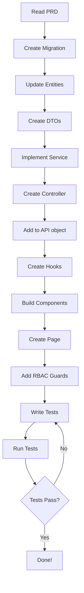

# 🚀 START HERE - AI Agent Quick Start Guide

## Welcome, AI Agent!

This guide will get you from zero to building features in 10 minutes.

---

## ⚡ 5-Minute Context Loading

### 1. **What is MedSource Pro?** (30 seconds)
B2B medical supply e-commerce platform with:
- **Quote-based ordering** (not instant checkout)
- **Consultative sales** (dedicated sales reps)
- **Dropshipping** (vendors fulfill orders)
- **5 user roles** (Customer → Sales Rep → Fulfillment → Sales Manager → Admin)

### 2. **What's Already Built?** (1 minute)
✅ **Working**:
- RBAC system (complete)
- Quote submission (customers can request quotes)
- Quote viewing (sales reps can see quotes)
- Quote marking as read (sales reps only)
- User authentication
- Product catalog
- Shopping cart

❌ **Missing** (What you'll build):
- Quote pricing workflow (sales rep enters vendor/customer pricing)
- Order management (full lifecycle)
- Dashboard (role-based stats)
- Product management (CRUD)
- Analytics
- Vendor management
- Email automation

### 3. **Tech Stack** (30 seconds)
- **Frontend**: Next.js 16.0.10 + React 19.2.3 + TypeScript 5.9 + Tailwind 4 + DaisyUI
- **Backend**: .NET 8 + C# + PostgreSQL + Entity Framework Core
- **Auth**: Cookie-based auth (cookies-next)
- **Testing**: Vitest 4 + React Testing Library + Playwright (E2E)
- **Forms**: React Hook Form + Zod
- **State**: Zustand

### 4. **Key Patterns You MUST Follow** (3 minutes)

#### Pattern 1: API Layer (MANDATORY)
```typescript
// ❌ NEVER do this
const response = await HttpService.post('/quotes', data)

// ✅ ALWAYS do this
const response = await API.Quotes.create(data)
```
**Location**: `client/app/_shared/services/api.ts`

#### Pattern 2: Form Submission (MANDATORY)
```typescript
// ❌ NEVER manually handle API calls
const handleSubmit = async (data) => {
  try {
    const response = await API.Quotes.create(data)
    toast.success('Created!')
  } catch (error) {
    toast.error('Failed!')
  }
}

// ✅ ALWAYS use useFormSubmit
const { submit, isSubmitting } = useFormSubmit(
  async (data) => API.Quotes.create(data),
  {
    successMessage: 'Quote created',
    errorMessage: 'Failed to create quote'
  }
)
```
**Location**: `client/app/_shared/hooks/useFormSubmit.ts`

#### Pattern 3: Entity Classes (Frontend)
```typescript
// ✅ Use ES6 classes with constructor pattern
export default class Quote {
  id?: string
  name: Name = new Name()
  status: QuoteStatus = QuoteStatus.Unread
  
  constructor(param?: Partial<Quote>) {
    if (param) {
      Object.assign(this, param)
      if (param.name) this.name = new Name(param.name)
    }
  }
}
```
**Location**: `client/app/_classes/[Entity].ts`

#### Pattern 4: DTOs (Backend)
```csharp
// ✅ Flat structure, validation attributes
public class CreateQuoteRequest
{
    [Required]
    [MaxLength(50)]
    public string FirstName { get; set; } = string.Empty;
    
    [EmailAddress]
    public string Email { get; set; } = string.Empty;
    
    public List<CartProductItem> Items { get; set; } = new();
}
```
**Location**: `server/Classes/Others/[Name].cs`

#### Pattern 5: Validation Schemas (Frontend)
```typescript
// ✅ Zod schemas in ONE file
export const quoteSchema = z.object({
  firstName: z.string().min(1),
  email: z.string().email(),
  items: z.array(z.object({
    productId: z.string(),
    quantity: z.coerce.number().positive()
  })).min(1)
})

export type QuoteFormData = z.infer<typeof quoteSchema>
```
**Location**: `client/app/_core/validation/validation-schemas.ts`

#### Pattern 6: Barrel Exports (MANDATORY)
```typescript
// ✅ Every folder with 2+ files needs index.ts
// _components/index.ts
export { default as QuoteHeader } from './QuoteHeader'
export { default as QuoteProducts } from './QuoteProducts'
export * from './hooks'

// Usage
import { QuoteHeader, QuoteProducts } from './_components'
```

#### Pattern 7: RBAC Guards
```tsx
// ✅ Protect UI elements
<PermissionGuard 
  resource={Resources.Quotes} 
  action={Actions.Update}
>
  <Button onClick={handleApprove}>Approve</Button>
</PermissionGuard>
```
**Location**: `client/app/_components/common/guards/PermissionGuard.tsx`

---

## 📁 Folder Structure (The Truth)

### Frontend
```
client/app/
├── _classes/          # Entity classes (Quote, Order, Product)
├── _components/       # Shared UI (Button, Input, Modal, guards)
├── _core/            # Validation schemas (ONE file for ALL)
├── _shared/          # API layer, hooks (useFormSubmit, useZodForm)
├── _types/           # Shared TypeScript types
└── app/              # Route pages
    ├── quotes/
    │   ├── [id]/
    │   │   ├── _components/  # Private to this route
    │   │   │   ├── hooks/    # Custom hooks
    │   │   │   └── index.ts  # Barrel export
    │   │   └── page.tsx
    │   └── page.tsx
    └── dashboard/
        └── page.tsx
```

### Backend
```
server/
├── Controllers/       # API endpoints
├── Services/DB/      # Business logic
├── Entities/         # Database entities
├── Classes/Others/   # DTOs (CreateXRequest, etc.)
├── Authorization/    # RBAC handlers
└── Migrations/       # Database migrations
```

---

## 🎯 Your First Task: Build Dashboard

### Step 1: Read the PRD (5 min)
Open: `prd_dashboard.md` (in this folder)

### Step 2: Understand RBAC (2 min)
- **Customer**: See own stats (orders, quotes)
- **Sales Rep**: See assigned quotes/orders
- **Sales Manager**: See team stats
- **Admin**: See everything

### Step 3: Follow the Checklist (10 min)

#### Backend Checklist:
- [ ] Create `DashboardStatsResponse` DTO
- [ ] Add `GetDashboardStats()` method to relevant services
- [ ] Create `/api/dashboard/stats` endpoint
- [ ] Add authorization policy
- [ ] Filter data by role (customer sees own, sales rep sees assigned, etc.)

#### Frontend Checklist:
- [ ] Add `API.Dashboard.getStats()` to `api.ts`
- [ ] Create `useDashboardStats` hook (uses `useFormSubmit`)
- [ ] Create components: `StatsCard`, `QuickActions`, `RecentActivity`
- [ ] Create `dashboard/page.tsx`
- [ ] Add barrel exports (`_components/index.ts`)
- [ ] Wrap role-specific UI in `<PermissionGuard>`

#### Testing Checklist:
- [ ] Unit tests: `StatsCard.test.tsx`
- [ ] Hook tests: `useDashboardStats.test.ts`
- [ ] RBAC tests: Customer can't see sales rep stats
- [ ] Integration: Full dashboard load for each role

### Step 4: Run Tests (2 min)
```bash
# Frontend
npm test

# Backend
dotnet test
```

---

## 🚨 Common Mistakes to Avoid

### ❌ Don't Create These (They don't exist):
- ~~`features/` folder~~ (Use `app/app/[route]/_components/`)
- ~~`repositories/` layer~~ (Services use DbContext directly)
- ~~Custom `ProtectedRoute`~~ (Use existing `PermissionGuard`)
- ~~Separate `types/` per feature~~ (Types in `_types/` or inline)

### ❌ Don't Call These Directly:
- ~~`HttpService.post()`~~ (Use `API.X.method()`)
- ~~Manual try/catch in forms~~ (Use `useFormSubmit`)
- ~~Fetch/axios~~ (Use `API` object)

### ❌ Don't Skip These:
- Barrel exports (`index.ts`)
- RBAC guards on UI
- Authorization policies on backend
- Type safety (no `any` types)
- Tests (95%+ coverage)

---

## 🧪 Testing Standards (Military-Grade)

### Every Feature Must Have:

1. **Unit Tests** (95%+ coverage)
```typescript
describe('QuotePricingEditor', () => {
  it('should validate customer price >= vendor cost', () => {
    // Test validation
  })
  
  it('should call API on submit', async () => {
    // Mock API, test call
  })
})
```

2. **RBAC Tests** (100% of guards)
```typescript
describe('Dashboard RBAC', () => {
  it('should show customer-only stats to customers', () => {
    // Render as customer role, verify UI
  })
  
  it('should hide admin stats from sales reps', () => {
    // Render as sales rep, verify no admin UI
  })
})
```

3. **Integration Tests** (Critical paths)
```typescript
describe('Quote Pricing Flow', () => {
  it('should complete full workflow', async () => {
    // 1. Sales rep marks quote as read
    // 2. Sales rep inputs pricing
    // 3. Sales rep approves quote
    // 4. Quote status updates
    // 5. Customer can view quote
  })
})
```

### Test Utilities
- **Frontend**: `client/test-utils/renderWithProviders.tsx`
- **RBAC Mocks**: `client/test-utils/rbacTestBuilders.ts`

---

## 📊 RBAC Quick Reference

| Role | Level | Typical Use Case |
|------|-------|------------------|
| Customer | 100 | Place orders, view own data |
| Sales Rep | 300 | Process quotes, manage assigned orders |
| Fulfillment | 200 | Update shipping, add tracking |
| Sales Manager | 400 | Manage team, view all quotes/orders |
| Admin | 500 | Full system access, manage users/products |

### Backend Authorization
```csharp
[Authorize(Policy = "SalesRepOrAbove")]
public async Task<IResponse<Quote>> GetQuote(Guid id)
{
    var user = await _accountService.GetById();
    
    // Sales Rep: Can only view assigned quotes
    if (user.Role == AccountRole.SalesRep) {
        if (quote.AssignedSalesRepId != user.Id.ToString()) {
            return Unauthorized<Quote>("Not your quote");
        }
    }
    
    // Sales Manager/Admin: Can view all
    return Ok<Quote>("quote_retrieved", quote);
}
```

### Frontend Guards
```tsx
// Hide button from customers
<PermissionGuard 
  resource={Resources.Quotes} 
  action={Actions.Approve}
>
  <Button onClick={handleApprove}>Approve Quote</Button>
</PermissionGuard>

// Custom permission check
const permissions = useQuotePermissions(quote)
if (permissions.canUpdate) {
  return <PricingEditor />
}
```

---

## 🏗️ Implementation Workflow

### For Every Feature:



### Time Estimate per Feature:
- **Backend**: 2-4 hours (migration, DTO, service, controller)
- **Frontend**: 4-6 hours (hooks, components, page, guards)
- **Testing**: 2-3 hours (unit, RBAC, integration)
- **Total**: 8-13 hours per feature

---

## 🎓 Learning Resources

### Understand the Business:
- Read: `md/business_flow.md` (30 min)
- Key concept: Quote-based ordering (not instant checkout)
- Key workflow: Quote Request → Pricing → Approval → Order → Fulfillment

### Understand the Code:
- **API Layer**: `client/app/_shared/services/api.ts`
- **Form Hooks**: `client/app/_shared/hooks/useFormSubmit.ts`
- **RBAC**: `client/app/_components/common/guards/PermissionGuard.tsx`
- **Validation**: `client/app/_core/validation/validation-schemas.ts`

### Example Code (Study These):
- **Quote Detail Page**: `client/app/app/quotes/[id]/page.tsx`
- **Quote Service**: `server/Services/DB/QuoteService.cs`
- **Quote Controller**: `server/Controllers/QuotesController.cs`

---

## 🚀 Ready to Start?

1. ✅ I've read this guide (10 min)
2. ✅ I understand the key patterns (API layer, useFormSubmit, etc.)
3. ✅ I know the folder structure (ACTUAL)
4. ✅ I've reviewed the RBAC matrix
5. ✅ I'm ready to read my first PRD

**Next Steps:**
1. Open `prd_dashboard.md` - Start with Dashboard
2. Follow the implementation workflow
3. Write tests as you go (don't wait until end)
4. Run tests frequently (`npm test`, `dotnet test`)

---

## 🆘 Need Help?

### Common Issues:

**Q: Where do I put this component?**
A: 
- Shared across app? → `client/app/_components/`
- Specific to one route? → `client/app/app/[route]/_components/`

**Q: How do I make API calls?**
A: Always use `API.X.method()` from `@_shared/services/api`

**Q: How do I handle form submission?**
A: Always use `useFormSubmit` hook

**Q: Where do validation schemas go?**
A: ALL in ONE file: `client/app/_core/validation/validation-schemas.ts`

**Q: How do I protect a route/component?**
A: Use `<PermissionGuard>` or `usePermissions` hook

**Q: Tests are failing?**
A: Check:
1. Did you mock the API? (`vi.spyOn(API.X, 'method')`)
2. Did you mock RBAC? (Use `rbacTestBuilders`)
3. Did you use `renderWithProviders`?

---

## 🔧 Environment Setup

### Prerequisites
```bash
# Required versions
Node.js 18+ (v20 recommended)
.NET 8 SDK
PostgreSQL 14+
```

### Initial Setup
```bash
# Frontend
cd client
npm install
cp .env.example .env.local  # If exists, otherwise create

# Backend
cd server
dotnet restore
dotnet ef database update  # Apply migrations
```

### Running the App
```bash
# Start backend (Terminal 1)
cd server
dotnet run

# Start frontend (Terminal 2)
cd client
npm run dev
```

### Environment Variables (client/.env.local)
```env
NEXT_PUBLIC_API_URL=https://localhost:7001/api
```

---

## 🐛 Debugging Tips

### Common Frontend Errors

**Error: "Failed to fetch" / Network Error**
```typescript
// Check if backend is running
// Check NEXT_PUBLIC_API_URL in .env.local
// Check CORS settings in backend Program.cs
```

**Error: "Cannot read property of undefined"**
```typescript
// Check if data is loaded before accessing
// Use optional chaining: data?.property
// Add null checks in components
```

**Error: "Hydration mismatch"**
```typescript
// Check for browser-only code in server components
// Use 'use client' directive if needed
// Wrap browser APIs in useEffect
```

### Common Backend Errors

**Error: "401 Unauthorized"**
```csharp
// Check JWT token is being sent
// Check cookie is present
// Verify token hasn't expired
```

**Error: "Foreign key violation"**
```csharp
// Check entity relationships
// Ensure related entities exist
// Check cascade delete settings
```

### Test Debugging
```bash
# Run single test file
npm test -- path/to/file.test.ts

# Run tests with UI
npm run test:ui

# Run with verbose output
npm test -- --reporter=verbose

# Debug specific test
npm test -- -t "test name pattern"
```

---

## 🌱 Database Seeding

### Development Seed Data
The backend includes seed data for development. To reset:

```bash
cd server
dotnet ef database drop --force
dotnet ef database update
dotnet run  # Seeds will be applied on startup
```

### Test Data
For testing, use the test builders:
```typescript
import { createMockQuote, createMockUser } from '@/test-utils/testDataBuilders'
import { createMockUserWithRole } from '@/test-utils/rbacTestBuilders'

// Create test data
const mockAdmin = createMockUserWithRole('Admin')
const mockQuote = createMockQuote({ customerId: 1 })
```

---

## ✅ Pre-Flight Checklist

Before writing ANY code:

- [ ] I've read the PRD for this feature
- [ ] I understand what each role can/cannot do
- [ ] I know which existing components/hooks to reuse
- [ ] I've planned my file structure
- [ ] I've identified the API endpoints needed
- [ ] I've written test cases (at least mentally)

---

**You're ready! Let's build something amazing.** 🚀