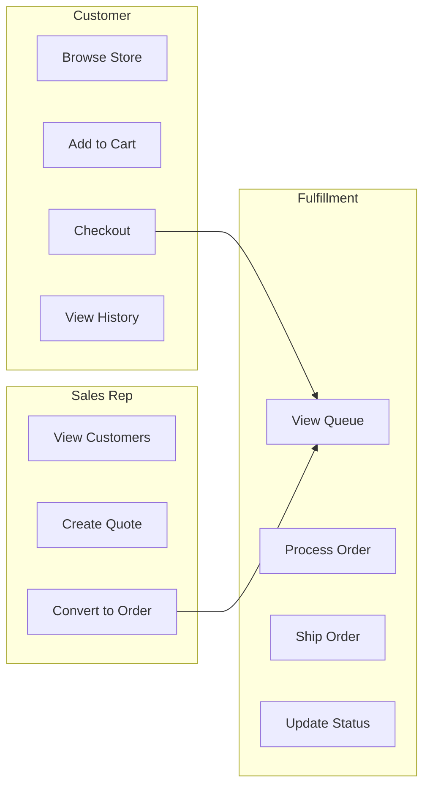
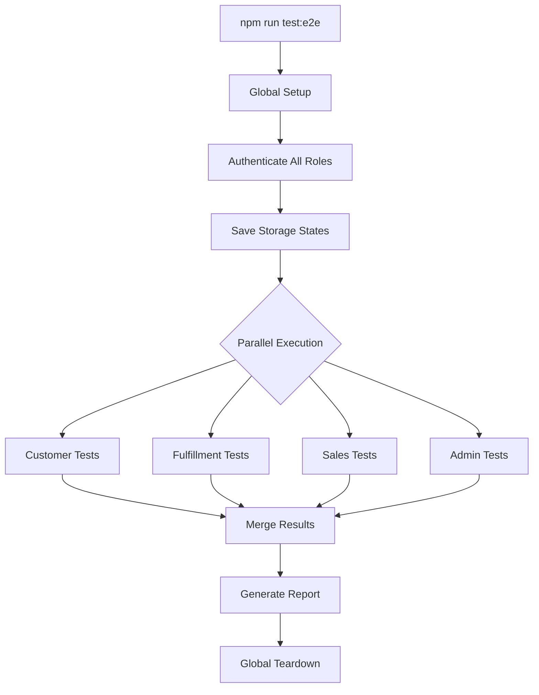

# 01 - Architecture and Scope

> **Document**: Playwright Integration Plan - Part 1 of 5
> **Version**: 1.0
> **Last Updated**: January 2026
> **Status**: Implementation Ready

---

## 1. Overview

This document defines the architecture, scope, and test pyramid placement for MedSource Pro's multi-role E2E testing suite using Playwright 1.57.0.

### 1.1 Goal

Enable a single command to run full order-lifecycle tests for every role:

```bash
# Run all roles
npm run test:e2e

# Run specific role
npm run test:e2e:customer
npm run test:e2e:fulfillment
npm run test:e2e:admin
```

### 1.2 Success Criteria

-   All 6 roles can complete an order lifecycle test
-   Tests run in parallel with isolated storage state
-   CI pipeline gates PRs on test failures
-   Flaky test rate below 2%
-   Full suite runtime under 10 minutes

### 1.3 Business Alignment (From Prometheus Plan)

The E2E plan must reflect the business strategy and non-negotiables:

-   **Time-to-value**: 2-4 weeks to first order is the promise; tests must validate fast, repeatable onboarding flows.
-   **Quote-to-order correctness**: quotes must convert reliably with pricing accuracy and approval auditability.
-   **Pricing trust**: price explainability and margin guardrails are core differentiators.
-   **ERP-connected truth**: QuickBooks/NetSuite sync reliability is a competitive wedge.
-   **Partner-first model**: white-label configuration is allowed; workflow logic is not customizable.
-   **Vertical focus**: medical supply workflows and terminology must be validated in critical paths.

---

## 2. Test Pyramid Placement

```
                    /\
                   /  \
                  / E2E \        <-- Playwright (this suite)
                 /  Tests \          ~20% of tests
                /----------\
               / Integration \   <-- Vitest + MSW
              /    Tests      \      ~30% of tests
             /----------------\
            /    Unit Tests    \ <-- Vitest
           /____________________\    ~50% of tests
```

### 2.1 What E2E Tests Cover

| Scope                       | Description                                | Example                 |
| --------------------------- | ------------------------------------------ | ----------------------- |
| Critical User Journeys      | End-to-end flows that touch multiple pages | Order lifecycle         |
| Role-Based Access           | Verify each role sees appropriate UI/data  | Admin vs Customer views |
| Cross-Browser Compatibility | Chrome, Firefox, Safari on critical paths  | Customer checkout       |
| Mobile Responsiveness       | Key flows on mobile viewports              | Customer order          |

### 2.2 What E2E Tests Do NOT Cover

| Out of Scope              | Reason                          | Where Tested  |
| ------------------------- | ------------------------------- | ------------- |
| Component rendering logic | Too slow, covered by unit tests | Vitest        |
| API response shapes       | Integration tests are faster    | Vitest + MSW  |
| Edge case validation      | Unit tests are more efficient   | Vitest        |
| Performance benchmarks    | Requires specialized tooling    | Lighthouse CI |

---

## 3. Role Coverage Matrix

MedSource Pro has 6 user roles, each with distinct permissions and workflows:

| Role              | Level | Primary Workflow                      | Test Priority |
| ----------------- | ----- | ------------------------------------- | ------------- |
| **Customer**      | 1000  | Place orders, view history            | Critical      |
| **Fulfillment**   | 2000  | Process orders, manage shipping       | High          |
| **Sales Rep**     | 3000  | Manage customers, create quotes       | High          |
| **Sales Manager** | 4000  | Team oversight, approve quotes        | Medium        |
| **Admin**         | 5000  | System configuration, user management | Medium        |
| **Super Admin**   | 9999  | Full system access, tenant management | Low           |

### 3.1 Order Lifecycle by Role

Each role interacts with orders differently:



---

## 4. Project Structure

### 4.1 Current Structure

```
client/
├── playwright.config.ts          # Multi-project configuration
├── .auth/                        # Storage state files (gitignored)
│   ├── customer.json
│   ├── fulfillment.json
│   ├── sales-rep.json
│   ├── sales-manager.json
│   ├── admin.json
│   └── super-admin.json
├── e2e/
│   ├── global-setup.ts           # Auth all roles before tests
│   ├── global-teardown.ts        # Cleanup after tests
│   ├── fixtures/
│   │   ├── index.ts              # Custom test fixtures
│   │   └── test-data.ts          # Test data constants
│   ├── pages/                    # Page Object Models
│   │   ├── BasePage.ts
│   │   ├── LoginPage.ts
│   │   ├── StorePage.ts
│   │   ├── CartPage.ts
│   │   ├── CheckoutPage.ts
│   │   ├── OrdersPage.ts
│   │   └── DashboardPage.ts
│   ├── journeys/                 # Test specs by role
│   │   ├── customer/
│   │   │   └── order-lifecycle.spec.ts
│   │   ├── fulfillment/          # TO CREATE
│   │   ├── sales/                # TO CREATE
│   │   ├── sales-manager/        # TO CREATE
│   │   ├── admin/                # TO CREATE
│   │   ├── super-admin/          # TO CREATE
│   │   └── public/
│   │       └── login.spec.ts
│   └── utils/
│       └── index.ts              # Helper utilities
└── test-results/                 # Artifacts (gitignored)
```

### 4.2 Planned Additions

| Path                                            | Purpose                    | Priority |
| ----------------------------------------------- | -------------------------- | -------- |
| `journeys/fulfillment/order-processing.spec.ts` | Fulfillment order workflow | High     |
| `journeys/sales/quote-lifecycle.spec.ts`        | Sales rep quote-to-order   | High     |
| `journeys/sales-manager/team-oversight.spec.ts` | Manager approvals          | Medium   |
| `journeys/admin/user-management.spec.ts`        | Admin configuration        | Medium   |
| `journeys/super-admin/tenant-config.spec.ts`    | Tenant management          | Low      |
| `pages/QuotesPage.ts`                           | Quote management POM       | High     |
| `pages/AdminPage.ts`                            | Admin panel POM            | Medium   |

---

## 5. Multi-Project Architecture

### 5.1 Why Multi-Project

Playwright projects allow:

-   Parallel execution of role-specific tests
-   Isolated storage state per role
-   Distinct tagging for CI filtering
-   Cross-browser testing on critical paths

### 5.2 Project Configuration

```typescript
// playwright.config.ts - Existing structure
projects: [
	{ name: 'setup', testMatch: /global-setup\.ts/ },
	{ name: 'customer', storageState: '.auth/customer.json', tag: '@customer' },
	{ name: 'fulfillment', storageState: '.auth/fulfillment.json', tag: '@fulfillment' },
	{ name: 'sales-rep', storageState: '.auth/sales-rep.json', tag: '@sales' },
	{ name: 'sales-manager', storageState: '.auth/sales-manager.json', tag: '@sales-manager' },
	{ name: 'admin', storageState: '.auth/admin.json', tag: '@admin' },
	{ name: 'super-admin', storageState: '.auth/super-admin.json', tag: '@super-admin' },
	{ name: 'unauthenticated', tag: '@public' },
]
```

### 5.3 Execution Flow



---

## 6. Order Lifecycle Definition

The "order lifecycle" is the critical path that all roles must support:

### 6.1 Customer Lifecycle

1. **Browse Store** - View products, search, filter
2. **Add to Cart** - Select products, set quantities
3. **Checkout** - Enter shipping, select payment
4. **Confirmation** - Receive order number
5. **View History** - See order in list, view details
6. **Price Trust** - Verify pricing explanations and guardrails where surfaced

### 6.2 Fulfillment Lifecycle

1. **View Queue** - See pending orders
2. **Process Order** - Mark as processing
3. **Prepare Shipment** - Generate labels
4. **Ship Order** - Update tracking
5. **Complete** - Mark as delivered

### 6.3 Sales Lifecycle

1. **Create Quote** - For customer
2. **Submit for Approval** - If over threshold
3. **Validate Pricing** - Explainability + audit trail for overrides
4. **Convert to Order** - On acceptance
5. **Track Order** - Monitor fulfillment

---

## 7. Critical Path Definition

Tests tagged `@critical` or `@smoke` must pass for every PR:

| Test                               | Role              | What It Validates                   |
| ---------------------------------- | ----------------- | ----------------------------------- |
| Customer can complete order        | Customer          | Full checkout flow                  |
| Fulfillment can process order      | Fulfillment       | Order state transitions             |
| Sales can create and convert quote | Sales Rep         | Quote-to-order flow                 |
| Admin can manage users             | Admin             | RBAC functionality                  |
| Pricing explainability is visible  | Sales/Admin       | Price trace + guardrail enforcement |
| ERP export reliability             | Admin/Fulfillment | Order export sync correctness       |

---

## 8. Next Steps

After this architecture is approved:

1. **02-auth-and-data-strategy.md** - Credential management and test data isolation
2. **03-test-design-rules.md** - Implementation rules and red lines
3. **04-role-journeys.md** - Detailed test specs for each role
4. **05-ci-cd-and-quality-gates.md** - Pipeline configuration

---

## 9. References

-   [Playwright Multi-Project Documentation](https://playwright.dev/docs/test-projects)
-   [Playwright Authentication](https://playwright.dev/docs/auth)
-   [MedSource Pro RBAC System](../PRDs/prd_rbac_management.md)
-   [Existing Customer Journey Test](../../e2e/journeys/customer/order-lifecycle.spec.ts)
