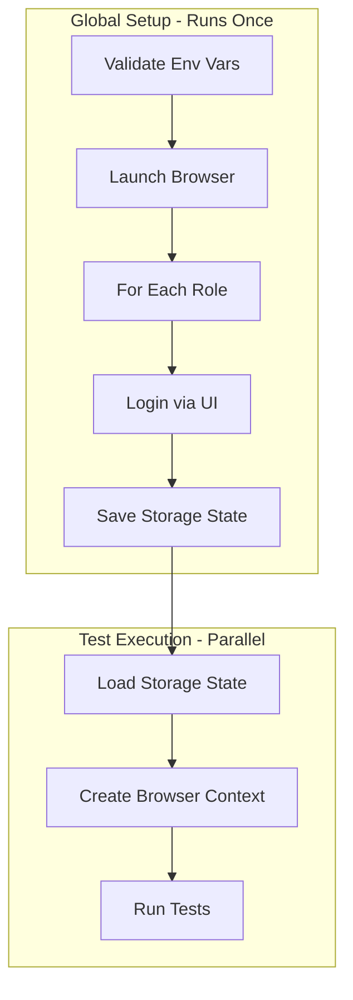

# 02 - Authentication and Data Strategy

> **Document**: Playwright Integration Plan - Part 2 of 5
> **Version**: 1.0
> **Last Updated**: January 2026
> **Status**: Implementation Ready

---

## 1. Overview

This document defines how authentication and test data are managed across the E2E test suite, ensuring security, isolation, and determinism.

### 1.1 Core Principles

1. **No hardcoded credentials** - All secrets via environment variables
2. **Storage state reuse** - Authenticate once, reuse across tests
3. **Role isolation** - Each role has its own storage state file
4. **Data determinism** - Tests create their own data or use seeded fixtures
5. **No shared mutable state** - Tests must not depend on each other

### 1.2 Business Constraints (Must Be Reflected in Tests)

These are non-negotiable rules from the business plan that affect test data and auth flows:

-   **Configuration-only policy**: Partners can configure branding, terminology, pricing rules, and workflow triggers, but **cannot change core workflow logic**.
-   **Quote-based workflow**: RFQ/quote, approvals, and conversion to order must be traceable.
-   **Pricing guardrails**: margin floors, discount caps, and override approvals must be enforced.
-   **Price explainability**: every pricing decision should be auditable (\"Why this price?\").
-   **ERP truth**: QuickBooks/NetSuite sync must be reliable, not best-effort.

---

## 2. Authentication Architecture

### 2.1 Storage State Flow



### 2.2 Storage State Files

Location: `client/.auth/` (gitignored)

| File                 | Role          | Contents               |
| -------------------- | ------------- | ---------------------- |
| `customer.json`      | Customer      | Cookies + localStorage |
| `fulfillment.json`   | Fulfillment   | Cookies + localStorage |
| `sales-rep.json`     | Sales Rep     | Cookies + localStorage |
| `sales-manager.json` | Sales Manager | Cookies + localStorage |
| `admin.json`         | Admin         | Cookies + localStorage |
| `super-admin.json`   | Super Admin   | Cookies + localStorage |

### 2.3 Storage State Lifecycle

```
┌─────────────────────────────────────────────────────────────────┐
│                    Storage State Validity                        │
├─────────────────────────────────────────────────────────────────┤
│ Created: Global setup authenticates and saves                    │
│ Valid for: 24 hours (configurable)                              │
│ Reused: Subsequent test runs within validity window             │
│ Refreshed: When expired or manually cleared                     │
│ Cleared: On CI (fresh each run) or `npm run test:e2e:clear-auth`│
└─────────────────────────────────────────────────────────────────┘
```

---

## 3. Credential Management

### 3.1 Environment Variables Required

```bash
# Customer (Role Level 1000)
TEST_CUSTOMER_EMAIL=
TEST_CUSTOMER_PASSWORD=

# Fulfillment Coordinator (Role Level 2000)
TEST_FULFILLMENT_EMAIL=
TEST_FULFILLMENT_PASSWORD=

# Sales Representative (Role Level 3000)
TEST_SALESREP_EMAIL=
TEST_SALESREP_PASSWORD=

# Sales Manager (Role Level 4000)
TEST_SALESMANAGER_EMAIL=
TEST_SALESMANAGER_PASSWORD=

# Administrator (Role Level 5000)
TEST_ADMIN_EMAIL=
TEST_ADMIN_PASSWORD=

# Super Administrator (Role Level 9999)
TEST_SUPERADMIN_EMAIL=
TEST_SUPERADMIN_PASSWORD=
```

### 3.2 Local Development Setup

1. Copy the example file:

    ```bash
    cp client/.env.test.example client/.env.test.local
    ```

2. Fill in credentials (obtain from team lead or use seeded accounts)

3. The `.env.test.local` file is gitignored

### 3.3 CI/CD Secrets Configuration

For GitHub Actions:

```yaml
# .github/workflows/e2e.yml
env:
    TEST_CUSTOMER_EMAIL: ${{ secrets.TEST_CUSTOMER_EMAIL }}
    TEST_CUSTOMER_PASSWORD: ${{ secrets.TEST_CUSTOMER_PASSWORD }}
    TEST_FULFILLMENT_EMAIL: ${{ secrets.TEST_FULFILLMENT_EMAIL }}
    TEST_FULFILLMENT_PASSWORD: ${{ secrets.TEST_FULFILLMENT_PASSWORD }}
    # ... etc for all roles
```

### 3.4 Credential Rotation Policy

| Environment | Rotation Frequency | Process                                 |
| ----------- | ------------------ | --------------------------------------- |
| Development | Quarterly          | Manual rotation, update .env.test.local |
| Staging     | Monthly            | Automated via CI secret rotation        |
| Production  | N/A                | E2E tests never run against production  |

---

## 4. Test Data Strategy

### 4.1 Data Categories

| Category                | Strategy                       | Example                       |
| ----------------------- | ------------------------------ | ----------------------------- |
| **Reference Data**      | Pre-seeded in DB, read-only    | Product catalog, categories   |
| **User Data**           | Per-role test accounts         | Customer, admin accounts      |
| **Transactional Data**  | Created per test run           | Orders, quotes                |
| **Cleanup Data**        | Deleted after test             | Temporary entities            |
| **Pricing Rules**       | Seeded + configured per tenant | Price lists, tiers, overrides |
| **Audit Data**          | System-generated, read-only    | Price trace, override reasons |
| **Integration Signals** | System-generated, read-only    | ERP sync events, export logs  |

### 4.2 Data Isolation Patterns

#### Pattern 1: Unique IDs per Test

```typescript
// Generate unique identifiers to avoid collisions
import { generateTestId } from '../fixtures'

test('should create order', async ({ page }) => {
	const orderId = generateTestId('order') // order-1705123456789-abc123
	// ... test logic
})
```

#### Pattern 2: API Setup (Preferred)

```typescript
// Create test data via API before UI interaction
test.beforeEach(async ({ apiContext }) => {
	// Create a product via API
	await apiContext.post('/api/products', {
		data: { name: `Test Product ${Date.now()}`, price: 99.99 },
	})
})
```

#### Pattern 3: Database Seeding

For reference data that must exist:

```typescript
// test-data.ts - Constants that match seeded database
export const TEST_PRODUCTS = {
	surgicalGloves: {
		name: 'Surgical Gloves',
		sku: 'SG-001',
		price: 29.99,
	},
	// ... matches database seed
}
```

### 4.3 Data Cleanup Strategy

| Approach        | When to Use             | Implementation                     |
| --------------- | ----------------------- | ---------------------------------- |
| **No cleanup**  | Read-only operations    | Default for most tests             |
| **Soft delete** | Test creates entities   | Mark as deleted, filter in queries |
| **Hard delete** | Test database pollution | API call in afterEach              |
| **Fresh DB**    | Nightly regression      | CI job resets test database        |

### 4.4 Test Data Files

Location: `client/e2e/fixtures/test-data.ts`

```typescript
// Current structure - already implemented
export const TEST_PRODUCTS = { /* ... */ }
export const TEST_ADDRESSES = { /* ... */ }
export const TEST_CUSTOMERS = { /* ... */ }
export const TEST_ORDERS = { /* ... */ }
export const TEST_PAYMENT_METHODS = { /* ... */ }
export const TEST_QUOTES = { /* ... */ }

// Helper functions
export function generateTestEmail(prefix?: string): string
export function generateTestPONumber(): string
export function generateTestCompanyName(): string
export function calculateOrderTotal(items: Array<...>): number
```

---

## 5. Role-Specific Data Requirements

### 5.1 Customer Role

| Data Type          | Source               | Notes                         |
| ------------------ | -------------------- | ----------------------------- |
| Account            | Seeded test account  | customer-tester@medsource.com |
| Shipping addresses | Test constants       | TEST_ADDRESSES                |
| Order history      | Created during tests | Unique per test run           |

### 5.2 Fulfillment Role

| Data Type       | Source                  | Notes                            |
| --------------- | ----------------------- | -------------------------------- |
| Account         | Seeded test account     | fulfillment-tester@medsource.com |
| Order queue     | Customer-created orders | Tests depend on customer orders  |
| Shipping labels | Generated during test   | Mock or test mode                |

### 5.3 Sales Role

| Data Type     | Source                | Notes                         |
| ------------- | --------------------- | ----------------------------- |
| Account       | Seeded test account   | salesrep-tester@medsource.com |
| Customer list | Seeded + test-created | Mix of both                   |
| Quotes        | Created during tests  | Unique per test run           |

### 5.4 Admin Role

| Data Type   | Source               | Notes                      |
| ----------- | -------------------- | -------------------------- |
| Account     | Seeded test account  | admin-tester@medsource.com |
| User list   | All test accounts    | Read-only                  |
| Permissions | Seeded configuration | Read-only                  |

---

## 6. Network Control

### 6.1 When to Mock APIs

| Scenario                      | Mock?   | Reason                  |
| ----------------------------- | ------- | ----------------------- |
| Third-party payment processor | Yes     | Avoid real transactions |
| Email service                 | Yes     | Avoid spam              |
| Internal APIs                 | No      | Test real behavior      |
| Slow/unreliable endpoints     | Depends | Mock if causing flakes  |

### 6.2 Mock Implementation

```typescript
// Using Playwright route interception
test('should handle payment failure', async ({ page }) => {
	await page.route('**/api/payments/**', (route) => {
		route.fulfill({
			status: 400,
			json: { error: 'Payment declined' },
		})
	})

	// ... test handles error gracefully
})
```

---

## 7. Time Control

### 7.1 Timezone Configuration

```typescript
// playwright.config.ts - already configured
use: {
  timezoneId: 'America/New_York',
}
```

### 7.2 Date Mocking (When Needed)

```typescript
// For date-dependent assertions
test('should show correct expiry', async ({ page }) => {
	// Mock the clock to a specific date
	await page.clock.install({ time: new Date('2026-06-15T12:00:00') })

	// ... test logic with predictable dates
})
```

---

## 8. Security Considerations

### 8.1 Red Lines (NEVER Do)

-   Commit credentials to version control
-   Use production credentials in tests
-   Store sensitive data in test artifacts
-   Share storage state files across machines
-   Log credentials in test output

### 8.2 Security Checklist

-   [ ] `.env.test.local` is in `.gitignore`
-   [ ] `.auth/` directory is in `.gitignore`
-   [ ] CI secrets are configured correctly
-   [ ] Test accounts have limited permissions
-   [ ] No PII in test data constants

---

## 9. Validation and Error Handling

### 9.1 Credential Validation

The global setup validates all credentials before running tests:

```typescript
// From global-setup.ts
function validateTestCredentials(): void {
	const requiredVars = [
		'TEST_CUSTOMER_EMAIL',
		'TEST_CUSTOMER_PASSWORD',
		// ... all 12 variables
	]

	const missing = requiredVars.filter((v) => !process.env[v])

	if (missing.length > 0) {
		// Throws with clear instructions
		throw new Error(`Missing ${missing.length} required test credential(s)`)
	}
}
```

### 9.2 Auth Failure Handling

When authentication fails:

1. Screenshot saved to `.auth/{role}-auth-failure.png`
2. Error logged with role name and error message
3. Other roles continue authenticating
4. Tests for failed role are skipped (not failed)

---

## 10. Implementation Checklist

-   [x] Storage state authentication implemented
-   [x] Credential validation in global setup
-   [x] Environment variable pattern established
-   [x] `.env.test.example` created
-   [x] Test data fixtures defined
-   [ ] CI secrets configured (manual step)
-   [ ] API setup helpers implemented
-   [ ] Network mocking utilities added
-   [ ] Time control helpers documented

---

## 11. References

-   [Playwright Authentication Guide](https://playwright.dev/docs/auth)
-   [Playwright API Testing](https://playwright.dev/docs/api-testing)
-   [Global Setup Implementation](../../e2e/global-setup.ts)
-   [Test Data Fixtures](../../e2e/fixtures/test-data.ts)
