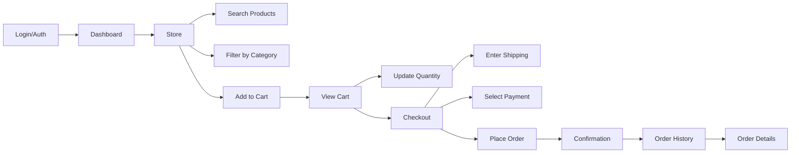
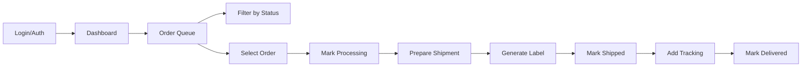
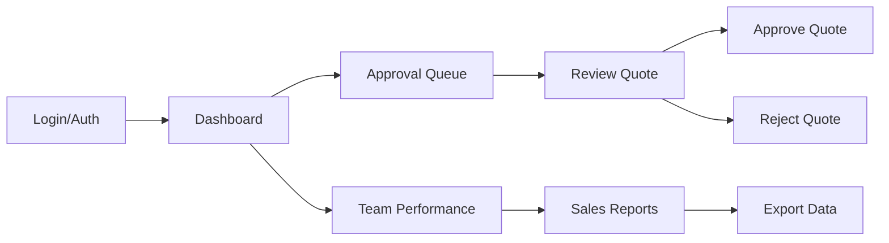
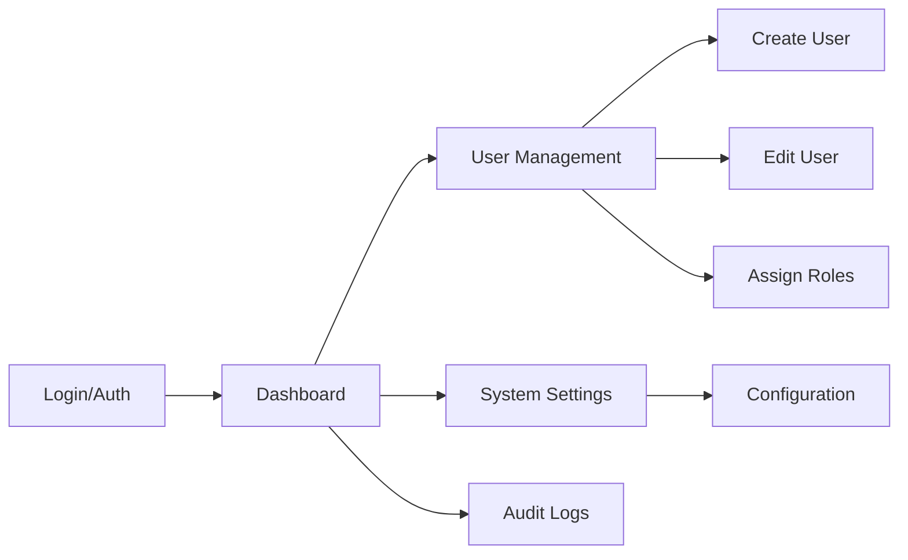
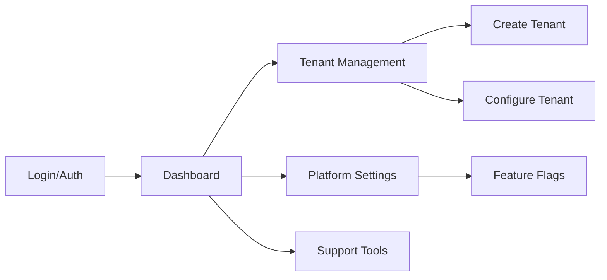
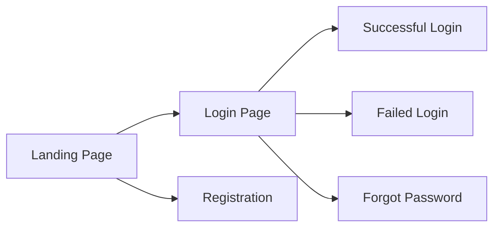

# 04 - Role Journeys

> **Document**: Playwright Integration Plan - Part 4 of 5
> **Version**: 1.0
> **Last Updated**: January 2026
> **Status**: Implementation Ready

---

## 1. Overview

This document defines the specific test journeys for each of the 6 user roles in MedSource Pro, including page mappings, data requirements, and implementation checklists.

### 1.1 Journey Definition

A "journey" is an end-to-end workflow that:

-   Starts from a role's entry point (login or dashboard)
-   Completes a business-critical task
-   Verifies the expected outcome
-   Can run independently without dependencies

---

## 2. Customer Journey (Level 1000)

### 2.1 Journey Map



### 2.2 Test File Structure

```
e2e/journeys/customer/
├── order-lifecycle.spec.ts     # EXISTING - Full order flow
├── store-browsing.spec.ts      # TO CREATE - Search, filter, browse
├── cart-management.spec.ts     # TO CREATE - Cart operations
├── order-history.spec.ts       # TO CREATE - View past orders
└── dashboard.spec.ts           # TO CREATE - Dashboard widgets
```

### 2.3 Test Cases

| Test Name                                 | Priority | Tags             | Status      |
| ----------------------------------------- | -------- | ---------------- | ----------- |
| Complete order from store to confirmation | Critical | @smoke @critical | IMPLEMENTED |
| Search for products                       | High     | @regression      | IMPLEMENTED |
| Filter products by category               | Medium   | @regression      | IMPLEMENTED |
| Add multiple products to cart             | High     | @regression      | IMPLEMENTED |
| Update cart quantity                      | Medium   | @regression      | IMPLEMENTED |
| View order in history                     | High     | @critical        | IMPLEMENTED |
| View order details                        | Medium   | @regression      | IMPLEMENTED |
| Empty cart handling                       | Low      | @regression      | TODO        |
| Checkout validation errors                | Medium   | @regression      | TODO        |
| Reorder from history                      | Medium   | @regression      | TODO        |
| Price explanation visible                 | Medium   | @critical        | TODO        |

### 2.4 Page Objects Required

| Page          | File                     | Status      |
| ------------- | ------------------------ | ----------- |
| StorePage     | `pages/StorePage.ts`     | IMPLEMENTED |
| CartPage      | `pages/CartPage.ts`      | IMPLEMENTED |
| CheckoutPage  | `pages/CheckoutPage.ts`  | IMPLEMENTED |
| OrdersPage    | `pages/OrdersPage.ts`    | IMPLEMENTED |
| DashboardPage | `pages/DashboardPage.ts` | IMPLEMENTED |

### 2.5 Data Requirements

```typescript
// Required test data for customer journey
const customerData = {
	// From fixtures
	shippingAddress: TEST_ADDRESSES.shipping,
	billingAddress: TEST_ADDRESSES.billing,
	paymentMethod: TEST_PAYMENT_METHODS.invoice,

	// Generated per test
	uniquePONumber: generateTestPONumber(),
	// Pricing context
	pricingRuleSet: 'contract + volume tiers',
}
```

---

## 3. Fulfillment Journey (Level 2000)

### 3.1 Journey Map



### 3.2 Test File Structure

```
e2e/journeys/fulfillment/
├── order-processing.spec.ts    # TO CREATE - Main workflow
├── queue-management.spec.ts    # TO CREATE - Queue filtering
├── shipment-labels.spec.ts     # TO CREATE - Label generation
└── status-updates.spec.ts      # TO CREATE - Order status changes
```

### 3.3 Test Cases

| Test Name                 | Priority | Tags             | Status |
| ------------------------- | -------- | ---------------- | ------ |
| View pending orders queue | Critical | @smoke @critical | TODO   |
| Process an order          | Critical | @smoke @critical | TODO   |
| Generate shipment label   | High     | @critical        | TODO   |
| Update order to shipped   | High     | @critical        | TODO   |
| Add tracking number       | Medium   | @regression      | TODO   |
| Filter queue by status    | Medium   | @regression      | TODO   |
| Bulk process orders       | Low      | @regression      | TODO   |
| Handle backorder          | Low      | @regression      | TODO   |
| ERP export status visible | High     | @critical        | TODO   |

### 3.4 Page Objects Required

| Page                 | File                            | Status |
| -------------------- | ------------------------------- | ------ |
| FulfillmentQueuePage | `pages/FulfillmentQueuePage.ts` | TODO   |
| OrderProcessingPage  | `pages/OrderProcessingPage.ts`  | TODO   |
| ShipmentPage         | `pages/ShipmentPage.ts`         | TODO   |

### 3.5 Data Requirements

```typescript
// Required test data for fulfillment journey
const fulfillmentData = {
	// Pre-requisite: Customer order must exist
	pendingOrder: {
		// Created by customer test or API setup
		status: 'pending',
		items: TEST_ORDERS.smallOrder.items,
	},

	// Mock data for shipment
	trackingNumber: generateTestTrackingNumber(),
	carrier: 'UPS',
	// ERP sync validation
	exportStatus: 'queued|synced',
}
```

### 3.6 Dependencies

-   Requires at least one pending order in the system
-   Consider API setup to create test orders before fulfillment tests
-   If ERP integration enabled, verify export status in UI/logs

---

## 4. Sales Rep Journey (Level 3000)

### 4.1 Journey Map

```mermaid
flowchart LR
    Login[Login/Auth] --> Dashboard[Dashboard]
    Dashboard --> Customers[Customer List]
    Customers --> Select[Select Customer]
    Select --> Create[Create Quote]
    Create --> Products[Add Products]
    Products --> Pricing[Apply Pricing]
    Pricing --> Submit[Submit Quote]
    Submit --> Track[Track Status]
    Track --> Convert[Convert to Order]
```



### 4.2 Test File Structure

```
e2e/journeys/sales/
├── quote-lifecycle.spec.ts     # TO CREATE - Full quote flow
├── customer-management.spec.ts # TO CREATE - Customer operations
├── pricing-rules.spec.ts       # TO CREATE - Pricing application
└── quote-conversion.spec.ts    # TO CREATE - Quote to order
```

### 4.3 Test Cases

| Test Name                                | Priority | Tags             | Status |
| ---------------------------------------- | -------- | ---------------- | ------ |
| View customer list                       | High     | @critical        | TODO   |
| Create quote for customer                | Critical | @smoke @critical | TODO   |
| Add products to quote                    | High     | @critical        | TODO   |
| Apply discount pricing                   | High     | @critical        | TODO   |
| Submit quote for approval                | High     | @critical        | TODO   |
| Convert approved quote to order          | Critical | @smoke @critical | TODO   |
| Track quote status                       | Medium   | @regression      | TODO   |
| Edit pending quote                       | Medium   | @regression      | TODO   |
| Clone existing quote                     | Low      | @regression      | TODO   |
| Price trace visible on quote             | High     | @critical        | TODO   |
| Margin guardrail blocks invalid discount | High     | @critical        | TODO   |

### 4.4 Page Objects Required

| Page            | File                       | Status |
| --------------- | -------------------------- | ------ |
| CustomersPage   | `pages/CustomersPage.ts`   | TODO   |
| QuotesPage      | `pages/QuotesPage.ts`      | TODO   |
| QuoteEditorPage | `pages/QuoteEditorPage.ts` | TODO   |

### 4.5 Data Requirements

```typescript
// Required test data for sales journey
const salesData = {
	// Existing customer to create quote for
	customer: TEST_CUSTOMERS.existingCustomer,

	// Quote contents
	quote: TEST_QUOTES.standardQuote,

	// Generated per test
	uniqueQuoteRef: generateTestQuoteRef(),
	// Pricing rules to exercise guardrails
	discountAboveThreshold: true,
}
```

---

## 5. Sales Manager Journey (Level 4000)

### 5.1 Journey Map



### 5.2 Test File Structure

```
e2e/journeys/sales-manager/
├── quote-approvals.spec.ts     # TO CREATE - Approval workflow
├── team-oversight.spec.ts      # TO CREATE - Team management
└── reporting.spec.ts           # TO CREATE - Sales reports
```

### 5.3 Test Cases

| Test Name                                 | Priority | Tags             | Status |
| ----------------------------------------- | -------- | ---------------- | ------ |
| View approval queue                       | High     | @critical        | TODO   |
| Approve pending quote                     | Critical | @smoke @critical | TODO   |
| Reject quote with reason                  | High     | @critical        | TODO   |
| View team performance                     | Medium   | @regression      | TODO   |
| Export sales report                       | Medium   | @regression      | TODO   |
| Set discount limits                       | Low      | @regression      | TODO   |
| Approve pricing override with audit trail | High     | @critical        | TODO   |

### 5.4 Page Objects Required

| Page              | File                         | Status |
| ----------------- | ---------------------------- | ------ |
| ApprovalQueuePage | `pages/ApprovalQueuePage.ts` | TODO   |
| TeamDashboardPage | `pages/TeamDashboardPage.ts` | TODO   |
| ReportsPage       | `pages/ReportsPage.ts`       | TODO   |

### 5.5 Data Requirements

```typescript
// Required test data for sales manager journey
const managerData = {
	// Pre-requisite: Quote pending approval
	pendingApproval: {
		// Created by sales rep test or API setup
		status: 'pending_approval',
		amount: 10000, // Over threshold
	},
}
```

---

## 6. Admin Journey (Level 5000)

### 6.1 Journey Map



### 6.2 Test File Structure

```
e2e/journeys/admin/
├── user-management.spec.ts     # TO CREATE - User CRUD
├── role-assignment.spec.ts     # TO CREATE - RBAC
├── system-settings.spec.ts     # TO CREATE - Configuration
└── audit-logs.spec.ts          # TO CREATE - Audit trail
```

### 6.3 Test Cases

| Test Name                          | Priority | Tags             | Status |
| ---------------------------------- | -------- | ---------------- | ------ |
| View user list                     | High     | @critical        | TODO   |
| Create new user                    | Critical | @smoke @critical | TODO   |
| Edit user details                  | High     | @critical        | TODO   |
| Assign role to user                | Critical | @smoke @critical | TODO   |
| Revoke user access                 | High     | @critical        | TODO   |
| View audit logs                    | Medium   | @regression      | TODO   |
| Update system settings             | Medium   | @regression      | TODO   |
| Cannot access super admin features | High     | @security        | TODO   |

### 6.4 Page Objects Required

| Page           | File                      | Status |
| -------------- | ------------------------- | ------ |
| UsersPage      | `pages/UsersPage.ts`      | TODO   |
| UserEditorPage | `pages/UserEditorPage.ts` | TODO   |
| RolesPage      | `pages/RolesPage.ts`      | TODO   |
| AuditLogsPage  | `pages/AuditLogsPage.ts`  | TODO   |
| SettingsPage   | `pages/SettingsPage.ts`   | TODO   |

### 6.5 Data Requirements

```typescript
// Required test data for admin journey
const adminData = {
	// New user to create
	newUser: {
		email: generateTestEmail('newuser'),
		firstName: 'Test',
		lastName: 'User',
		role: 'Customer', // Lower than admin
	},
}
```

---

## 7. Super Admin Journey (Level 9999)

### 7.1 Journey Map



### 7.2 Test File Structure

```
e2e/journeys/super-admin/
├── tenant-management.spec.ts   # TO CREATE - Tenant CRUD
├── platform-config.spec.ts     # TO CREATE - Platform settings
└── support-tools.spec.ts       # TO CREATE - Support features
```

### 7.3 Test Cases

| Test Name                 | Priority | Tags        | Status |
| ------------------------- | -------- | ----------- | ------ |
| View tenant list          | High     | @critical   | TODO   |
| Create new tenant         | Medium   | @regression | TODO   |
| Configure tenant settings | Medium   | @regression | TODO   |
| Access all admin features | High     | @security   | TODO   |
| Platform-level settings   | Low      | @regression | TODO   |

### 7.4 Page Objects Required

| Page                 | File                            | Status |
| -------------------- | ------------------------------- | ------ |
| TenantsPage          | `pages/TenantsPage.ts`          | TODO   |
| TenantConfigPage     | `pages/TenantConfigPage.ts`     | TODO   |
| PlatformSettingsPage | `pages/PlatformSettingsPage.ts` | TODO   |

---

## 8. Public Journey (Unauthenticated)

### 8.1 Journey Map



### 8.2 Test File Structure

```
e2e/journeys/public/
├── login.spec.ts               # EXISTING - Login flows
├── registration.spec.ts        # TO CREATE - Signup flow
└── password-reset.spec.ts      # TO CREATE - Password recovery
```

### 8.3 Test Cases

| Test Name                          | Priority | Tags             | Status      |
| ---------------------------------- | -------- | ---------------- | ----------- |
| Display login form                 | Critical | @smoke           | IMPLEMENTED |
| Show error for invalid credentials | High     | @critical        | IMPLEMENTED |
| Password field is secure           | High     | @security        | IMPLEMENTED |
| Navigate to forgot password        | Medium   | @regression      | IMPLEMENTED |
| Successful login redirects         | Critical | @smoke @critical | TODO        |
| New user registration              | Medium   | @regression      | TODO        |
| Password reset flow                | Medium   | @regression      | TODO        |

---

## 9. Cross-Role Integration Tests

Some tests require interaction between roles:

### 9.1 Order Handoff Test

```typescript
// Tests the complete order lifecycle across roles
test.describe('Order Handoff', () => {
	test.describe.configure({ mode: 'serial' })

	let orderNumber: string

	test('Customer creates order', async ({ customerContext }) => {
		// Customer places order
		orderNumber = await placeOrder(customerContext)
	})

	test('Fulfillment processes order', async ({ fulfillmentContext }) => {
		// Fulfillment team processes
		await processOrder(fulfillmentContext, orderNumber)
	})

	test('Customer sees shipped status', async ({ customerContext }) => {
		// Customer verifies status update
		await verifyOrderStatus(customerContext, orderNumber, 'shipped')
	})
})
```

### 9.2 Quote Approval Test

```typescript
// Tests quote approval workflow
test.describe('Quote Approval', () => {
	test.describe.configure({ mode: 'serial' })

	let quoteRef: string

	test('Sales rep creates quote', async ({ salesContext }) => {
		quoteRef = await createQuote(salesContext)
	})

	test('Manager approves quote', async ({ managerContext }) => {
		await approveQuote(managerContext, quoteRef)
	})

	test('Sales rep converts to order', async ({ salesContext }) => {
		await convertToOrder(salesContext, quoteRef)
	})
})
```

---

## 10. Implementation Priority

### Phase 1: Core Journeys (Week 1-2)

-   [x] Customer order lifecycle
-   [ ] Fulfillment order processing
-   [ ] Sales quote creation
-   [ ] Public login flows

### Phase 2: Management Journeys (Week 3-4)

-   [ ] Sales manager approvals
-   [ ] Admin user management
-   [ ] Cross-role integration

### Phase 3: Advanced Journeys (Week 5+)

-   [ ] Super admin tenant management
-   [ ] Reporting and analytics
-   [ ] Edge cases and error handling

---

## 11. Command Reference

```bash
# Run all customer tests
npm run test:e2e:customer

# Run all fulfillment tests
npm run test:e2e:fulfillment

# Run all sales tests
npm run test:e2e:sales

# Run specific journey
npm run test:e2e -- e2e/journeys/customer/order-lifecycle.spec.ts

# Run smoke tests across all roles
npm run test:e2e -- --grep @smoke

# Run critical tests for release
npm run test:e2e -- --grep @critical
```

---

## 12. References

-   [Playwright Project Configuration](../../playwright.config.ts)
-   [Existing Customer Journey](../../e2e/journeys/customer/order-lifecycle.spec.ts)
-   [Page Objects](../../e2e/pages/)
-   [Test Fixtures](../../e2e/fixtures/)
-   [RBAC Documentation](../PRDs/prd_rbac_management.md)
