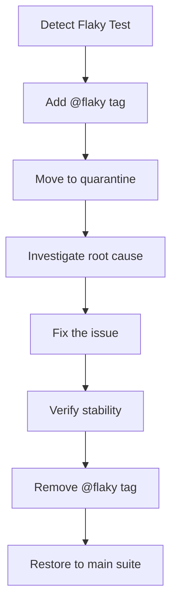

# 05 - CI/CD and Quality Gates

> **Document**: Playwright Integration Plan - Part 5 of 5
> **Version**: 1.0
> **Last Updated**: January 2026
> **Status**: Implementation Ready

---

## 1. Overview

This document defines the CI/CD pipeline configuration, quality gates, and operational procedures for running Playwright tests in MedSource Pro.

### 1.1 Pipeline Goals

1. **PR Gate**: Block merges if smoke tests fail
2. **Quality Assurance**: Full regression on main branch
3. **Cross-Browser Coverage**: Nightly runs across browsers
4. **Fast Feedback**: <5 minutes for smoke tests
5. **Reliable Results**: <2% flaky test rate

### 1.2 Business Goal Alignment

These quality gates map directly to Prometheus business goals:

-   **Time-to-value**: PR and main pipelines enforce fast order completion and onboarding readiness.
-   **Quote-to-order correctness**: Sales and pricing flows are gated at @critical.
-   **Pricing trust**: pricing explainability and guardrail enforcement are treated as release blockers.
-   **ERP-connected truth**: integration and export signal checks are included in critical suites.
-   **Partner model integrity**: white-label configuration must not alter core workflows.

---

## 2. Pipeline Architecture

### 2.1 Pipeline Overview

```mermaid
flowchart TD
    subgraph pr [PR Pipeline - Fast]
        PR_Trigger[PR Opened/Updated]
        PR_Lint[Lint + Type Check]
        PR_Unit[Unit Tests]
        PR_Smoke[E2E Smoke Tests]
        PR_Gate[Quality Gate]
    end

    subgraph main [Main Branch Pipeline]
        Main_Trigger[Push to Main]
        Main_Unit[Unit Tests]
        Main_E2E[Full E2E Suite]
        Main_Report[Generate Report]
    end

    subgraph nightly [Nightly Pipeline]
        Nightly_Trigger[Scheduled 2 AM]
        Nightly_Cross[Cross-Browser Tests]
        Nightly_Mobile[Mobile Tests]
        Nightly_A11y[Accessibility Tests]
        Nightly_Report[Full Report]
    end

    PR_Trigger --> PR_Lint
    PR_Lint --> PR_Unit
    PR_Unit --> PR_Smoke
    PR_Smoke --> PR_Gate

    Main_Trigger --> Main_Unit
    Main_Unit --> Main_E2E
    Main_E2E --> Main_Report

    Nightly_Trigger --> Nightly_Cross
    Nightly_Cross --> Nightly_Mobile
    Nightly_Mobile --> Nightly_A11y
    Nightly_A11y --> Nightly_Report
```



### 2.2 Test Distribution

| Pipeline | Tests                     | Target Time | Frequency     |
| -------- | ------------------------- | ----------- | ------------- |
| PR       | @smoke only               | <5 min      | Every PR      |
| Main     | @smoke + @critical        | <10 min     | Every push    |
| Nightly  | All tests + cross-browser | <30 min     | Daily 2 AM    |
| Release  | All tests, all browsers   | <45 min     | Before deploy |

---

## 3. GitHub Actions Configuration

### 3.1 PR Workflow

```yaml
# .github/workflows/pr-checks.yml
name: PR Checks

on:
    pull_request:
        branches: [main, develop]

jobs:
    lint-and-type-check:
        runs-on: ubuntu-latest
        steps:
            - uses: actions/checkout@v4
            - uses: actions/setup-node@v4
              with:
                  node-version: '20'
                  cache: 'npm'
                  cache-dependency-path: client/package-lock.json
            - run: npm ci
              working-directory: client
            - run: npm run lint
              working-directory: client
            - run: npm run type-check
              working-directory: client

    unit-tests:
        runs-on: ubuntu-latest
        steps:
            - uses: actions/checkout@v4
            - uses: actions/setup-node@v4
              with:
                  node-version: '20'
                  cache: 'npm'
                  cache-dependency-path: client/package-lock.json
            - run: npm ci
              working-directory: client
            - run: npm run test:run
              working-directory: client

    e2e-smoke:
        runs-on: ubuntu-latest
        needs: [lint-and-type-check, unit-tests]
        steps:
            - uses: actions/checkout@v4
            - uses: actions/setup-node@v4
              with:
                  node-version: '20'
                  cache: 'npm'
                  cache-dependency-path: client/package-lock.json

            - run: npm ci
              working-directory: client

            - name: Install Playwright Browsers
              run: npx playwright install --with-deps chromium
              working-directory: client

            - name: Run E2E Smoke Tests
              run: npm run test:e2e -- --grep @smoke --project=customer --project=unauthenticated
              working-directory: client
              env:
                  CI: true
                  PLAYWRIGHT_BASE_URL: ${{ secrets.STAGING_URL }}
                  TEST_CUSTOMER_EMAIL: ${{ secrets.TEST_CUSTOMER_EMAIL }}
                  TEST_CUSTOMER_PASSWORD: ${{ secrets.TEST_CUSTOMER_PASSWORD }}
                  # ... other secrets

            - name: Upload Test Results
              uses: actions/upload-artifact@v4
              if: always()
              with:
                  name: playwright-report-pr
                  path: client/playwright-report/
                  retention-days: 7
```

### 3.2 Main Branch Workflow

```yaml
# .github/workflows/main-tests.yml
name: Main Branch Tests

on:
    push:
        branches: [main]

jobs:
    full-e2e:
        runs-on: ubuntu-latest
        strategy:
            fail-fast: false
            matrix:
                project: [customer, fulfillment, sales-rep, admin]
        steps:
            - uses: actions/checkout@v4
            - uses: actions/setup-node@v4
              with:
                  node-version: '20'
                  cache: 'npm'
                  cache-dependency-path: client/package-lock.json

            - run: npm ci
              working-directory: client

            - name: Install Playwright Browsers
              run: npx playwright install --with-deps chromium
              working-directory: client

            - name: Run E2E Tests - ${{ matrix.project }}
              run: npm run test:e2e -- --project=${{ matrix.project }}
              working-directory: client
              env:
                  CI: true
                  PLAYWRIGHT_BASE_URL: ${{ secrets.STAGING_URL }}
                  TEST_CUSTOMER_EMAIL: ${{ secrets.TEST_CUSTOMER_EMAIL }}
                  TEST_CUSTOMER_PASSWORD: ${{ secrets.TEST_CUSTOMER_PASSWORD }}
                  TEST_FULFILLMENT_EMAIL: ${{ secrets.TEST_FULFILLMENT_EMAIL }}
                  TEST_FULFILLMENT_PASSWORD: ${{ secrets.TEST_FULFILLMENT_PASSWORD }}
                  TEST_SALESREP_EMAIL: ${{ secrets.TEST_SALESREP_EMAIL }}
                  TEST_SALESREP_PASSWORD: ${{ secrets.TEST_SALESREP_PASSWORD }}
                  TEST_SALESMANAGER_EMAIL: ${{ secrets.TEST_SALESMANAGER_EMAIL }}
                  TEST_SALESMANAGER_PASSWORD: ${{ secrets.TEST_SALESMANAGER_PASSWORD }}
                  TEST_ADMIN_EMAIL: ${{ secrets.TEST_ADMIN_EMAIL }}
                  TEST_ADMIN_PASSWORD: ${{ secrets.TEST_ADMIN_PASSWORD }}
                  TEST_SUPERADMIN_EMAIL: ${{ secrets.TEST_SUPERADMIN_EMAIL }}
                  TEST_SUPERADMIN_PASSWORD: ${{ secrets.TEST_SUPERADMIN_PASSWORD }}

            - name: Upload Test Results
              uses: actions/upload-artifact@v4
              if: always()
              with:
                  name: playwright-report-${{ matrix.project }}
                  path: client/playwright-report/
                  retention-days: 14
```

### 3.3 Nightly Workflow

```yaml
# .github/workflows/nightly-e2e.yml
name: Nightly E2E Tests

on:
    schedule:
        - cron: '0 2 * * *' # 2 AM UTC daily
    workflow_dispatch: # Manual trigger

jobs:
    cross-browser:
        runs-on: ubuntu-latest
        strategy:
            fail-fast: false
            matrix:
                browser: [chromium, firefox, webkit]
        steps:
            - uses: actions/checkout@v4
            - uses: actions/setup-node@v4
              with:
                  node-version: '20'
                  cache: 'npm'
                  cache-dependency-path: client/package-lock.json

            - run: npm ci
              working-directory: client

            - name: Install Playwright Browsers
              run: npx playwright install --with-deps
              working-directory: client

            - name: Run Cross-Browser Tests - ${{ matrix.browser }}
              run: |
                  if [ "${{ matrix.browser }}" = "chromium" ]; then
                    npm run test:e2e -- --project=customer
                  elif [ "${{ matrix.browser }}" = "firefox" ]; then
                    npm run test:e2e -- --project=customer-firefox
                  else
                    npm run test:e2e -- --project=customer-webkit
                  fi
              working-directory: client
              env:
                  CI: true
                  # ... secrets

            - name: Upload Test Results
              uses: actions/upload-artifact@v4
              if: always()
              with:
                  name: playwright-report-${{ matrix.browser }}
                  path: client/playwright-report/
                  retention-days: 30

    mobile:
        runs-on: ubuntu-latest
        needs: cross-browser
        steps:
            - uses: actions/checkout@v4
            - uses: actions/setup-node@v4
              with:
                  node-version: '20'
                  cache: 'npm'
                  cache-dependency-path: client/package-lock.json

            - run: npm ci
              working-directory: client

            - name: Install Playwright Browsers
              run: npx playwright install --with-deps chromium webkit
              working-directory: client

            - name: Run Mobile Tests
              run: npm run test:e2e:mobile
              working-directory: client
              env:
                  CI: true
                  # ... secrets
```

---

## 4. Quality Gates

### 4.1 PR Quality Gate

| Check               | Threshold | Action on Fail |
| ------------------- | --------- | -------------- |
| Lint                | 0 errors  | Block merge    |
| Type check          | 0 errors  | Block merge    |
| Unit tests          | 100% pass | Block merge    |
| E2E smoke           | 100% pass | Block merge    |
| Time-to-first-order | 100% pass | Block merge    |

### 4.2 Main Branch Quality Gate

| Check                      | Threshold | Action on Fail |
| -------------------------- | --------- | -------------- |
| All E2E tests              | 100% pass | Alert team     |
| Flaky test rate            | <2%       | Alert team     |
| Test duration              | <10 min   | Alert team     |
| Quote-to-order correctness | 100% pass | Alert team     |
| Pricing explainability     | 100% pass | Alert team     |
| ERP export status          | 100% pass | Alert team     |

### 4.3 Release Quality Gate

| Check                | Threshold      | Action on Fail |
| -------------------- | -------------- | -------------- |
| All E2E tests        | 100% pass      | Block deploy   |
| Cross-browser        | 100% pass      | Block deploy   |
| Mobile tests         | 100% pass      | Block deploy   |
| Performance          | No regressions | Block deploy   |
| Pricing guardrails   | 100% pass      | Block deploy   |
| Quote audit trail    | 100% pass      | Block deploy   |
| ERP sync reliability | 100% pass      | Block deploy   |

---

## 5. Artifact Management

### 5.1 Test Artifacts

| Artifact     | When Generated | Retention |
| ------------ | -------------- | --------- |
| HTML Report  | Every run      | 7-30 days |
| Screenshots  | On failure     | 7 days    |
| Videos       | On failure     | 7 days    |
| Traces       | On first retry | 7 days    |
| JSON Results | Every run      | 30 days   |

### 5.2 Artifact Configuration

```typescript
// playwright.config.ts - already configured
use: {
  trace: 'on-first-retry',
  screenshot: 'only-on-failure',
  video: 'on-first-retry',
}

reporter: [
  ['html', { outputFolder: 'playwright-report' }],
  ['json', { outputFile: 'test-results/results.json' }],
]
```

### 5.3 Viewing Artifacts

```bash
# View HTML report locally
npm run test:e2e:report

# Download from GitHub Actions
# Go to Actions > Run > Artifacts > Download
```

---

## 6. Flaky Test Management

### 6.1 Flaky Test Definition

A test is "flaky" if it:

-   Fails intermittently with no code changes
-   Passes on retry without changes
-   Has >1% failure rate over 7 days

### 6.2 Flaky Test Workflow



### 6.3 Flaky Test Quarantine

```typescript
// Mark flaky tests
test.skip('should handle race condition @flaky', async () => {
	// This test is quarantined until fixed
})

// Or run separately
test.describe('Quarantined Tests @flaky', () => {
	test.skip(({ browserName }) => true, 'Quarantined - investigating')

	test('known flaky test', async () => {
		// ...
	})
})
```

### 6.4 Monitoring Dashboard

Track these metrics weekly:

| Metric              | Target | Current |
| ------------------- | ------ | ------- |
| Total flaky tests   | <5     | TBD     |
| Flaky test rate     | <2%    | TBD     |
| Average retry rate  | <5%    | TBD     |
| Tests in quarantine | <3     | TBD     |

---

## 7. Runtime Budgets

### 7.1 Target Times

| Suite           | Budget  | Enforcement          |
| --------------- | ------- | -------------------- |
| Smoke tests     | <5 min  | CI fails if exceeded |
| Critical tests  | <10 min | Warning if exceeded  |
| Full regression | <30 min | Warning if exceeded  |
| Cross-browser   | <45 min | No enforcement       |

### 7.2 Monitoring Runtime

```yaml
# In GitHub Actions workflow
- name: Run Tests with Timeout
  timeout-minutes: 15
  run: npm run test:e2e -- --grep @smoke
```

### 7.3 Optimizing Slow Tests

When tests exceed budget:

1. **Parallelize**: Use `fullyParallel: true`
2. **Shard**: Split across multiple workers
3. **Reduce retries**: Only retry on failure
4. **API setup**: Replace UI setup with API calls
5. **Skip slow**: Move to nightly suite

---

## 8. Environment Configuration

### 8.1 Environment Matrix

| Environment | URL                   | When Used   | Test Data |
| ----------- | --------------------- | ----------- | --------- |
| Local       | localhost:3000        | Development | Seeded    |
| Staging     | staging.medsource.com | CI/CD       | Seeded    |
| Production  | N/A                   | Never       | N/A       |

### 8.4 Business Policy Constraints

-   **White-label limits enforced**: branding/terminology changes allowed; workflow logic changes are not.
-   **ERP strategy alignment**: CI targets QuickBooks and NetSuite as supported connectors; SAP/Oracle are out of scope for E2E.
-   **Time-to-first-order**: smoke suite validates first-order readiness, not full enterprise rollout.

### 8.2 Environment Variables

```bash
# CI Environment Variables
CI=true
PLAYWRIGHT_BASE_URL=https://staging.medsource.com
API_BASE_URL=https://api.staging.medsource.com

# Test Credentials (from secrets)
TEST_CUSTOMER_EMAIL=***
TEST_CUSTOMER_PASSWORD=***
# ... etc
```

### 8.3 Database State

For CI:

-   Fresh database seeded before each nightly run
-   Test data isolated per parallel worker
-   No cleanup between runs (fresh DB daily)

---

## 9. Secrets Management

### 9.1 Required Secrets

Configure in GitHub Settings > Secrets:

```
# URLs
STAGING_URL

# Customer credentials
TEST_CUSTOMER_EMAIL
TEST_CUSTOMER_PASSWORD

# Fulfillment credentials
TEST_FULFILLMENT_EMAIL
TEST_FULFILLMENT_PASSWORD

# Sales credentials
TEST_SALESREP_EMAIL
TEST_SALESREP_PASSWORD
TEST_SALESMANAGER_EMAIL
TEST_SALESMANAGER_PASSWORD

# Admin credentials
TEST_ADMIN_EMAIL
TEST_ADMIN_PASSWORD
TEST_SUPERADMIN_EMAIL
TEST_SUPERADMIN_PASSWORD
```

### 9.2 Secret Rotation

| Secret Type    | Rotation              | Process                    |
| -------------- | --------------------- | -------------------------- |
| Test passwords | Quarterly             | Update in GitHub + backend |
| API keys       | Quarterly             | Update in GitHub           |
| URLs           | On environment change | Update in GitHub           |

---

## 10. Reporting and Alerts

### 10.1 Test Report Access

```bash
# After CI run, download report from GitHub Actions artifacts
# Or view summary in PR comments via github reporter
```

### 10.2 Failure Alerts

| Condition       | Alert              | Recipients       |
| --------------- | ------------------ | ---------------- |
| PR smoke fails  | PR comment         | PR author        |
| Main tests fail | Slack notification | #dev-alerts      |
| Nightly fails   | Email              | QA team          |
| >5% flaky rate  | Slack + email      | Engineering lead |

### 10.3 Slack Integration

```yaml
# Add to workflow
- name: Notify Slack on Failure
  if: failure()
  uses: slackapi/slack-github-action@v1
  with:
      channel-id: 'C0123456789'
      slack-message: 'E2E tests failed on ${{ github.ref }}'
  env:
      SLACK_BOT_TOKEN: ${{ secrets.SLACK_BOT_TOKEN }}
```

---

## 11. Commands Reference

### 11.1 Local Development

```bash
# Run all tests
npm run test:e2e

# Run specific project
npm run test:e2e:customer
npm run test:e2e:fulfillment
npm run test:e2e:admin

# Run with UI mode (debugging)
npm run test:e2e:ui

# Run headed (see browser)
npm run test:e2e:headed

# Run with trace enabled
npm run test:e2e:trace

# View last report
npm run test:e2e:report

# Run specific test file
npm run test:e2e -- e2e/journeys/customer/order-lifecycle.spec.ts

# Run tagged tests
npm run test:e2e -- --grep @smoke
npm run test:e2e -- --grep @critical
npm run test:e2e -- --grep-invert @slow
```

### 11.2 CI Commands

```bash
# Install browsers (CI only)
npx playwright install --with-deps

# Run with CI reporter
npm run test:e2e -- --reporter=github

# Generate HTML report
npm run test:e2e -- --reporter=html
```

---

## 12. Troubleshooting

### 12.1 Common CI Issues

| Issue                 | Cause                  | Solution                      |
| --------------------- | ---------------------- | ----------------------------- |
| Browser not found     | Browsers not installed | Add `playwright install` step |
| Timeout on login      | App not ready          | Increase `webServer.timeout`  |
| Missing secrets       | Secrets not configured | Add all required secrets      |
| Storage state expired | Auth too old           | Clear `.auth/` and re-run     |

### 12.2 Debugging Failed Tests

1. Download HTML report artifact
2. Open `playwright-report/index.html`
3. Click on failed test
4. View screenshot, video, trace
5. For traces: click "View Trace" in report

---

## 13. Implementation Checklist

-   [ ] Create `.github/workflows/pr-checks.yml`
-   [ ] Create `.github/workflows/main-tests.yml`
-   [ ] Create `.github/workflows/nightly-e2e.yml`
-   [ ] Configure GitHub secrets (12 credential vars)
-   [ ] Configure Slack alerts
-   [ ] Set up artifact retention policies
-   [ ] Document runbook for common issues
-   [ ] Train team on reading reports

---

## 14. References

-   [Playwright CI Configuration](https://playwright.dev/docs/ci)
-   [GitHub Actions Workflow Syntax](https://docs.github.com/en/actions)
-   [Existing Playwright Config](../../playwright.config.ts)
-   [Test Scripts in package.json](../../package.json)
